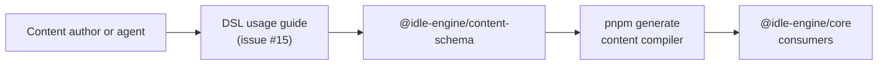

# Document DSL Usage Guidelines Design

## Document Control
- **Title**: Publish DSL usage guidelines for Idle Engine content pipeline
- **Authors**: Idle Engine Design-Authoring Agent
- **Reviewers**: Hans Jensen (Content Pipeline Owner), Docs Maintainers
- **Status**: Draft
- **Last Updated**: 2025-10-27
- **Related Issues**: [#15](https://github.com/hansjm10/Idle-Game-Engine/issues/15)
- **Execution Mode**: AI-led

## 1. Summary
To fulfill issue #15 (Document DSL usage guidelines), this proposal directs AI-led documentation work that translates the existing content DSL specifications into prescriptive authoring guidance covering naming, versioning, compatibility, and workflow expectations so designers and agents can produce consistent packs without re-discovering schema intent.

## 2. Context & Problem Statement
- **Background**: The content DSL already defines metadata, dependency, and compatibility semantics in depth (`docs/content-dsl-schema-design.md:298-356`) and the sample pack demonstrates generated artifacts (`packages/content-sample/src/index.ts:1-45`), yet contributors still rely on implicit knowledge when authoring packs highlighted by issue #15.
- **Problem**: The implementation plan explicitly lists “Document DSL usage guidelines (naming, versioning, compatibility matrix)” as outstanding work for issue #15 (`docs/implementation-plan.md:96-101`), leaving newcomers without a canonical reference and risking inconsistent data contracts.
- **Forces**: Deliverables for issue #15 must align with upcoming compiler automation (`docs/content-compiler-design.md:16-23`), honor runtime feature gating rules (`packages/content-schema/src/runtime-compat.ts:1-98`), and stay within the Phase 2 content roadmap commitments in `docs/idle-engine-design.md:166-244`.

## 3. Goals & Non-Goals
- **Goals**:
  - Provide a Docusaurus-hosted DSL usage guide that addresses all acceptance criteria in issue #15, including naming, versioning, and compatibility playbooks.
  - Deliver AI-consumable checklists and examples so autonomous agents can produce and validate packs without manual coaching, directly supporting issue #15.
  - Anchor cross-references into schema, compiler, and sample pack sources to reduce drift for issue #15 and enable traceability from documentation to implementation.
- **Non-Goals**:
  - Redesigning the content DSL schema or compiler behaviour is out of scope for issue #15.
  - Building new runtime features beyond documentation guardrails is not required to close issue #15.
  - Migrating legacy content packs beyond illustrative examples remains separate from issue #15.

## 4. Stakeholders, Agents & Impacted Surfaces
- **Primary Stakeholders**: Content pipeline maintainers, documentation maintainers, and runtime reviewers accountable for issue #15.
- **Agent Roles**:
  - DSL Documentation Agent — authors the new guide and integrates examples demanded by issue #15.
  - Schema Verification Agent — ensures narrative accuracy against schema contracts for issue #15.
  - Tooling Automation Agent — adds lint and link checks that guard the deliverables for issue #15.
- **Affected Packages/Services**: `docs/`, `packages/content-schema`, `packages/content-sample`, and `tools/content-schema-cli` will be touched to land issue #15.
- **Compatibility Considerations**: Documentation must reflect existing schema contracts (`packages/content-schema/src/pack.ts:70-315`) and runtime compatibility gates (`packages/content-schema/src/runtime-compat.ts:1-98`) so issue #15 does not introduce conflicting guidance.

## 5. Current State
Issue #15 currently depends on deep technical docs without a user-facing guide: the schema design doc explains required fields and compatibility checks (`docs/content-dsl-schema-design.md:298-356`), the compiler design shows artifact expectations (`docs/content-compiler-design.md:32-170`), and the sample pack README outlines regeneration steps (`packages/content-sample/README.md:1-27`). The CLI validates packs and builds manifests (`tools/content-schema-cli/src/generate.js:17-99`), but there is no single entry point translating these facts into prescriptive authoring steps, leaving the gap documented by issue #15.

## 6. Proposed Solution
### 6.1 Architecture Overview
- **Narrative**: For issue #15 we will publish `docs/content-dsl-usage-guidelines.md`, structured around author workflows (pack scaffolding, naming, dependency declaration, versioning, compatibility triage) with inline checklists, canonical examples sourced from the sample pack, and links into schema/CLI code. Automation will tag the doc during generation so agents can preload it before running compiler tasks.
- **Diagram**: The sequence below contextualizes issue #15 across the pipeline.

### 6.2 Detailed Design
- **Runtime Changes**: No runtime code changes are demanded by issue #15; documentation will instead reference existing import-time guards that enforce warning-free packs (`packages/content-sample/src/index.ts:23-45`) and describe how to interpret them.
- **Data & Schemas**: The guide will summarize metadata, dependency, and feature gate expectations with tables derived from schema definitions (`docs/content-dsl-schema-design.md:298-356`) and compatibility gates (`packages/content-schema/src/runtime-compat.ts:1-98`), satisfying the naming/versioning matrices called out in issue #15.
- **APIs & Contracts**: Guidance will cross-link to schema exports (`packages/content-schema/src/pack.ts:70-315`) and compiler outputs (`docs/content-compiler-design.md:161-173`) so every directive in issue #15 is tied to a stable contract.
- **Tooling & Automation**: To close issue #15 we will add markdownlint/link-check configuration for the new doc (referencing `packages/config-eslint` presets where applicable) and update `pnpm lint` documentation to ensure agents execute checks before submission.

### 6.3 Operational Considerations
- **Deployment**: The new guide will be added to the Docusaurus sidebar under Content Pipeline, ensuring issue #15 ships with documentation updates; Lefthook hooks will validate the doc during pre-commit.
- **Telemetry & Observability**: Structured log guidance from the compiler (`docs/content-compiler-design.md:161-172`) will be documented so agents resolving issue #15 know which `content_pack.*` events confirm healthy builds.
- **Security & Compliance**: The guide will reiterate that no sensitive data belongs in packs and that agents handling issue #15 must avoid embedding credentials or proprietary lore unavailable in the repo.

## 7. Work Breakdown & Delivery Plan
### 7.1 Issue Map
| Issue Title | Scope Summary | Proposed Assignee/Agent | Dependencies | Acceptance Criteria |
|-------------|---------------|-------------------------|--------------|---------------------|
| docs: author DSL usage guide | Draft `docs/content-dsl-usage-guidelines.md` sections (workflow, naming, versioning) to satisfy issue #15 | DSL Documentation Agent | Approval of this design | Guide merged with cross-links and example snippets passing markdownlint |
| docs: compile compatibility matrix | Build tables for engine feature gates, dependency policies, and migration notes required by issue #15 | Schema Verification Agent | docs: author DSL usage guide | Matrices validated against schema tests; references include `packages/content-schema/src/runtime-compat.ts` |
| tooling: enforce doc quality gates | Extend lint/test scripts so issue #15 cannot regress without warning | Tooling Automation Agent | docs: author DSL usage guide | `pnpm lint` fails on broken links; Lefthook runs new markdown checks |
| content-sample: align examples | Update sample pack comments/examples ensuring compliance showcased for issue #15 | Content Sample Steward Agent | docs: author DSL usage guide | Sample pack README references new guide; regenerated artifacts unchanged |

### 7.2 Milestones
- **Phase 1**: Draft and review the usage guide text for issue #15 within two working days of approval; secure reviewer sign-off and link placement.
- **Phase 2**: Implement automation, update sample references, and close issue #15 with verification evidence before the next sprint boundary.

### 7.3 Coordination Notes
- **Hand-off Package**: Provide agents with this design, schema docs, and sample pack artifacts so they can execute issue #15 without additional onboarding.
- **Communication Cadence**: Daily async updates in the content pipeline channel until issue #15 is merged; escalation to Hans Jensen on blocking schema questions.

## 8. Agent Guidance & Guardrails
- **Context Packets**: Agents tackling issue #15 must preload `docs/content-dsl-schema-design.md`, `docs/content-compiler-design.md`, `packages/content-sample/README.md`, and this design.
- **Prompting & Constraints**: Repeatedly remind agents via prompts that they implement documentation for issue #15, adhere to Conventional Commits, and keep outputs in ASCII.
- **Safety Rails**: Explicitly forbid modifications to `dist/` artifacts or schema behaviour while working on issue #15; rollback instructions require reverting doc-only changes if lint fails.
- **Validation Hooks**: Before declaring issue #15 resolved, run `pnpm lint`, `pnpm test --filter content-schema`, and `pnpm exec markdownlint docs/content-dsl-usage-guidelines.md`.

## 9. Alternatives Considered
- Consolidating guidance inside `docs/content-dsl-schema-design.md` was rejected for issue #15 because the audience needs a concise authoring guide rather than an exhaustive spec.
- Deferring documentation until after compiler rollout would leave issue #15 open and risk inconsistent pack authoring during the prototype milestone.

## 10. Testing & Validation Plan
To close issue #15 we will gate merges with `pnpm lint`, `pnpm test --filter content-schema`, targeted markdown linting, and manual verification that sample pack regeneration (`pnpm generate`) produces no diffs.

## 11. Risks & Mitigations
- Guidance drift as schemas evolve could reopen issue #15; mitigate by referencing automated tables sourced from schema exports and by adding ownership notes.
- Agents misinterpreting compatibility rules could block issue #15; mitigate with explicit examples and cross-links to runtime compatibility code.
- Documentation bloat may slow readers and stall issue #15; mitigate by enforcing concise bullet-driven sections with summary tables.

## 12. Rollout Plan
- **Milestones**: Publish the guide, wire automation, and announce resolution of issue #15 alongside Phase 2 completion.
- **Migration Strategy**: No data migration is needed; instead, channel existing wiki references to the new doc once issue #15 lands.
- **Communication**: Share the update in release notes and the content pipeline channel, explicitly referencing the closure of issue #15 and linking the new guide.

## 13. Open Questions
- Do we need localized versions of the guide to fully close issue #15? (Owner: Docs Maintainers)
- Should compatibility matrices for issue #15 include future roadmap modules beyond FEATURE_GATES? (Owner: Content pipeline maintainers)

## 14. Follow-Up Work
- Evaluate whether interactive tooling (lint rules or CLI scaffolders) should be added post–issue #15 to further streamline pack authoring.
- Plan a quarterly review cadence to refresh examples so issue #15 remains accurate as new packs ship.

## 15. References
- `docs/content-dsl-schema-design.md:298-356` — schema metadata, dependencies, and compatibility underpinning issue #15.
- `docs/content-compiler-design.md:32-173` — compiler architecture that the guide for issue #15 must describe.
- `packages/content-sample/README.md:1-27` — sample regeneration workflow cited by issue #15.
- `packages/content-sample/src/index.ts:1-45` — runtime import guard behaviour referenced in issue #15.
- `tools/content-schema-cli/src/generate.js:17-99` — validation workflow supporting issue #15.
- `docs/implementation-plan.md:96-101` — roadmap entry originating issue #15.
- `packages/content-schema/src/runtime-compat.ts:1-98` — feature gate logic crucial to issue #15.

## Appendix A — Glossary
- **Content DSL**: Schema-driven data language for packs; central subject of issue #15.
- **Pack slug**: Canonical identifier validated by `packSlugSchema`; key naming element in issue #15.
- **Compatibility matrix**: Table mapping features to runtime versions, mandated by issue #15.
- **AI agent**: Autonomous worker executing documentation tasks prescribed by issue #15.

## Appendix B — Change Log
| Date       | Author | Change Summary |
|------------|--------|----------------|
| 2025-10-27 | Idle Engine Design-Authoring Agent | Initial draft aligning this design with issue #15 |
