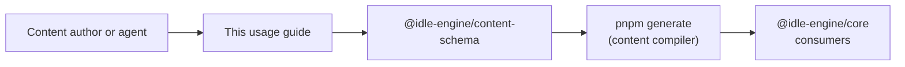

This guide turns the Content DSL specification into a step-by-step workflow for
authors and automation agents. It maps back to
`docs/content-dsl-usage-guidelines-design.md` and the schema behaviour in
`packages/content-schema/src/pack.ts`, so every directive stays tied to a
contract.

> Need deeper rationale? Read
> [`docs/content-dsl-schema-design.md`](content-dsl-schema-design.md),
> [`docs/content-compiler-design.md`](content-compiler-design.md), and inspect
> the canonical examples in `packages/content-sample`.

## Pipeline Overview

Authoring flows follow the same control points that the compiler and CLI
enforce:



The rest of this document walks the pipeline stage-by-stage with checklists,
examples, and validation hooks.

## Pack Scaffolding

Start from the structure maintained in `packages/content-sample`:

- Authoring sources live in `content/pack.json` (or `.json5` when comments help).
- Compiler outputs land in `content/compiled/` and `src/generated/` via
  `pnpm generate` and `tools/content-schema-cli/src/generate.js`.
- Runtime-facing re-exports live in `src/index.ts`, mirroring
  `packages/content-sample/src/index.ts`.

### Author checklist

- [ ] Create a new workspace package (for example `packages/<pack-slug>`) with a
  `content/` directory that mirrors the layout in
  `packages/content-sample/README.md`.
- [ ] Copy the latest `pnpm` scripts and TypeScript config from the sample pack
  so `pnpm generate`, `pnpm lint`, and tests stay aligned.
- [ ] Treat `content/compiled/` and `src/generated/` as generated outputs—never
  hand-edit them; always re-run `pnpm generate` after source edits.
- [ ] Commit the generated artifacts alongside `content/pack.json` so consumers
  never regenerate during install.

### Sample pack (prestige + balance) reference

The reference pack in `packages/content-sample/content/pack.json` embodies the
expanded economy and prestige layer described in
[`docs/sample-pack-balance-validation-design-issue-420.md`](sample-pack-balance-validation-design-issue-420.md).
Use it as a template when authoring or validating new packs:

- **Resources**: Energy (starts at 10), Crystal (hard currency, unlocks at
  Energy ≥ 25), Alloy (tier 2, unlocks at Crystal ≥ 50), Data Core (tier 2,
  unlocks at Alloy ≥ 40), and Prestige Flux (prestige-only, hidden until the
  prestige layer unlocks).
- **Generators**: Reactor (Energy), Crystal Harvester (consumes Energy), Forge
  (consumes Energy + Crystal → Alloy, linear cost: base 75, slope 12), Research
  Lab (consumes Energy + Alloy → Data Core, exponential cost: base 120,
  growth 1.12), and Gate Reactor (consumes Data Core → Prestige Flux; only
  visible/unlocked after prestige).
- **Upgrades**: Multi-tier reactor line (Insulation → Overclock → Phase
  Cooling), harvester line with repeatable Quantum Sieve, forge cost/rate tuning
  (Heat Shield, Auto-Feed), lab rate boosts (Insight Boost + repeatable
  Simulation Stack gated on Prestige Flux), and the prestige-centric Ascension
  Surge multiplier.
- **Prestige layer**: `sample-pack.ascension-alpha` unlocks at Data Core ≥ 500
  and Reactor level ≥ 10, resets base resources/generators/upgrades, and grants
  Prestige Flux via a clamped reward formula
  (`floor((energy + crystal + 2 * data-core) / 750)` capped to 1–5000). A
  minimum of 1 Prestige Flux is retained after each reset.

### Prestige gating conditions

`prestigeUnlocked` is easy to misread as "post-prestige". In the engine it means
"the prestige layer is currently available/unlocked" (i.e., the reset action is
available right now).

For "post-prestige only" content ("the player has prestiged at least once"),
use `prestigeCompleted`, which evaluates against the `{layerId}-prestige-count`
resource internally (so you don't need magic-string resource IDs).

```json
{
  "kind": "prestigeCompleted",
  "prestigeLayerId": "sample-pack.ascension-alpha"
}
```

If you need a higher threshold (for example "after 5 prestiges"), use
`prestigeCountThreshold`:

```json
{
  "kind": "prestigeCountThreshold",
  "prestigeLayerId": "sample-pack.ascension-alpha",
  "comparator": "gte",
  "count": 5
}
```

## Naming Conventions

The schema enforces naming through `packSlugSchema`, `contentIdSchema`, and
related validators (see `packages/content-schema/src/pack.ts`). Keep these rules
in mind before you run validation:

- `metadata.id`: lowercase slug (`a-z0-9-`), ≤32 chars, and stable after publish
  (`docs/content-dsl-schema-design.md` §5.5).
- Content IDs: reuse the slug casing from `contentIdSchema` and prefix with the
  pack slug to avoid collisions (`packages/content-schema/src/pack.ts`).
- `metadata.title` / `summary`: provide `default` copy and locale variants; keep
  `summary` ≤512 chars (`docs/content-dsl-schema-design.md` §5.5).
- `metadata.tags`: slug list (≤24 chars) with no spaces or uppercase characters
  (`docs/content-dsl-schema-design.md` §5.5).

### Naming checklist

- [ ] Pick a pack slug that matches the directory name and stays unique across
  `packages/*` (collisions surface via `ContentSchemaOptions.knownPacks` in
  `packages/content-schema/src/pack.ts`).
- [ ] Reserve a namespace prefix for content IDs before authoring modules and
  apply it consistently.
- [ ] Populate localized titles and summaries while setting `defaultLocale` and
  `supportedLocales` to avoid churn later.
- [ ] Document non-obvious tags or visibility flags in the package README so
  reviewers capture intent.

## Declaring Dependencies

Model relationships through `metadata.dependencies`:

- `requires`: hard dependencies that must be installed and activated first.
- `optional`: soft integrations flagged as warnings when missing (requires
  `ContentSchemaOptions.activePackIds` during validation).
- `conflicts`: mutually exclusive packs that should never load together.
- `provides`: capability slugs that downstream tooling can query.

Normalization deduplicates entries, sorts them, and blocks self-references (see
`docs/content-dsl-schema-design.md` §5.5 and
`packages/content-schema/src/modules/dependencies.ts`).

### Dependency checklist

- [ ] List every runtime prerequisite under `metadata.dependencies.requires`
  with a SemVer range that matches the dependency’s `metadata.version`.
- [ ] Mark optional integrations only when the pack functions without them and
  add contextual `message` fields for conflicts so tooling can explain why.
- [ ] Update team installation manifests (if any) whenever you add a new hard
  dependency so validation inputs stay aligned.
- [ ] Re-run `pnpm generate` and confirm the CLI logs omit
  `content_pack.dependency_cycle` warnings.

### Dependency compatibility matrix

<!-- markdownlint-disable MD013 -->

| Policy | Applies When | Enforcement | References |
| --- | --- | --- | --- |
| `requires` | Pack cannot function without another pack | Validation fails on missing packs; compiler blocks compilation | `docs/content-dsl-schema-design.md` (§5.5), `docs/content-compiler-design.md` (§5.6) |
| `optional` | Integration enhances behaviour but is not mandatory | Emits warnings when absent if `ContentSchemaOptions.activePackIds` supplies the install graph | `docs/content-dsl-schema-design.md` (§5.5), `packages/content-schema/src/modules/dependencies.ts` |
| `conflicts` | Packs must never load together | Validation errors guard against self-dependency; compiler logs failure with the conflicting slug | `docs/content-dsl-schema-design.md` (§5.5), `docs/content-compiler-design.md` (§5.6) |
| `provides` | Pack exposes capabilities for discovery tooling | Normalisation deduplicates entries; workspace summary records capability digests | `docs/content-dsl-schema-design.md` (§5.5), `docs/content-compiler-design.md` (§5.4) |

<!-- markdownlint-restore -->

## Versioning & Release Cadence

Content packs carry both a pack version and a runtime compatibility range:

- `metadata.version` must follow [Semantic Versioning](https://semver.org/) and
  increments whenever pack behaviour or data changes.
- `metadata.engine` expresses supported engine versions; validation uses
  `semver.satisfies()` and the feature gates in
  `packages/content-schema/src/runtime-compat.ts`.
- Compiler summaries (`src/generated/*summary*` in the sample pack) surface the
  slug, version, and warning count at import time
  (`packages/content-sample/src/index.ts:23-44`).

### Versioning checklist

- [ ] Bump `metadata.version` for every committed change that alters gameplay,
  data tables, or compatibility metadata.
- [ ] Align `metadata.engine` with the runtime tested locally (for example
  `>=0.4.0 <0.6.0`); widen ranges only after validating against newer runtimes.
- [ ] Capture notable changes in your package README or release notes so other
  authors can plan migrations.
- [ ] Inspect the generated summary module to confirm the digest and artifact
  hash changed when expected; unexpected stability often means missing source
  diffs.

## Compatibility Triage

Feature gates keep packs aligned with runtime capabilities. The current baseline
lives in `packages/content-schema/src/runtime-compat.ts`:

| Module | Introduced in | Documentation |
| --- | --- | --- |
| `automations` | `0.2.0` | `docs/idle-engine-design.md` (§6.2) |
| `transforms` | `0.3.0` | `docs/idle-engine-design.md` (§6.2) |
| `runtimeEvents` | `0.3.0` | `docs/runtime-event-pubsub-design.md` |
| `prestigeLayers` | `0.4.0` | `docs/idle-engine-design.md` (§6.2) |
| `guildPerks` | `0.5.0` | `docs/idle-engine-design.md` (§6.2) |

When `metadata.engine` omits or predates the required version, validation pushes
structured `FeatureViolation` errors or warnings (see
`resolveFeatureViolations` in `packages/content-schema/src/runtime-compat.ts`).

### Compatibility checklist

- [ ] Set `metadata.engine` before authoring gated modules so compatibility
  errors appear during `pnpm generate`.
- [ ] Treat feature-gate warnings (`severity: warning`) as TODOs—either upgrade
  the runtime target or trim gated modules before shipping.
- [ ] Include CLI logs from `pnpm generate` in review artifacts whenever
  compatibility adjustments are part of the change.
- [ ] If runtime contracts evolve, update this table and the pack metadata in
  the same pull request to avoid drift.

### Migration matrix

Use this matrix to plan schema evolution and pack migrations in lockstep with
the compiler and runtime guardrails described in the design docs.

<!-- markdownlint-disable MD013 -->

| Scenario | Expected action | References |
| --- | --- | --- |
| Schema fields added or behaviour changes | Run `pnpm generate` and revalidate packs; document the change in package README and update `metadata.version` to track the migration | `docs/content-dsl-schema-design.md` (§1, §5.5), `docs/content-compiler-design.md` (§5.5) |
| Dependency graph updates (new `requires` / `optional` edges) | Refresh installation manifests, rerun validation with updated `knownPacks`, and capture any new warnings in CLI logs | `docs/content-dsl-schema-design.md` (§5.5), `docs/content-compiler-design.md` (§5.6) |
| Runtime feature gates evolve | Synchronise this guide’s tables with `packages/content-schema/src/runtime-compat.ts`, adjust `metadata.engine`, and rerun schema tests to confirm compatibility | `packages/content-schema/src/runtime-compat.ts`, `docs/content-dsl-schema-design.md` (§5.5) |
| Compiler format version or digest rules change | Rebuild generated artifacts, inspect workspace summary digests, and note migration requirements in release notes | `docs/content-compiler-design.md` (§5.4-§5.5), `docs/content-dsl-schema-design.md` (§5.5) |

<!-- markdownlint-restore -->

## Transform Patterns & Cycle Detection

The content schema validates transform chains and unlock conditions for cycles
at **build time** (during `pnpm generate`) to prevent content packs that would
cause runaway production loops or deadlocked progression at runtime.
Understanding these validation rules helps authors design safe and functional
transform networks.

**Important**: Cycle detection is a **build-time safety check** that runs
during content pack validation. Content packs containing cycles will be
rejected before they can be loaded into the game engine, ensuring problematic
configurations never reach runtime.

### What Constitutes a Cycle

A **transform cycle** exists when transforms form a closed loop through their
resource dependencies:

- **Direct cycle (A → B → A)**: Transform A produces a resource that Transform B
  consumes, and Transform B produces a resource that Transform A consumes.
- **Indirect cycle (A → B → C → A)**: A chain of transforms that eventually
  feeds back to the starting transform through intermediate resources.
- **Multi-resource cycle**: Transforms with multiple inputs/outputs that create
  circular dependencies (for example Transform A consumes X + Y and produces Z,
  while Transforms B and C consume Z to produce X and Y respectively).

An **unlock condition cycle** exists when entities have circular unlock
dependencies:

- Resource A unlocks when Resource B ≥ threshold
- Resource B unlocks when Resource A ≥ threshold
- Similar patterns exist for generators, upgrades, achievements, and other
  entities with `unlockCondition` fields

Both types of cycles are **detected automatically** during validation and will
cause `pnpm generate` to fail with detailed error messages showing the cycle
path.

### Safe Transform Patterns

Design transforms using these patterns to avoid cycles:

#### ✅ Linear transformation chains

```json
{
  "transforms": [
    {
      "id": "raw-to-refined",
      "inputs": [{ "resourceId": "raw-ore", "amount": { "kind": "constant", "value": 1 } }],
      "outputs": [{ "resourceId": "refined-metal", "amount": { "kind": "constant", "value": 1 } }]
    },
    {
      "id": "refined-to-alloy",
      "inputs": [{ "resourceId": "refined-metal", "amount": { "kind": "constant", "value": 2 } }],
      "outputs": [{ "resourceId": "alloy", "amount": { "kind": "constant", "value": 1 } }]
    }
  ]
}
```

This creates a one-way progression: raw-ore → refined-metal → alloy.

#### ✅ Resource sinks (consumables)

```json
{
  "transforms": [
    {
      "id": "craft-boost",
      "inputs": [
        { "resourceId": "mana", "amount": { "kind": "constant", "value": 100 } },
        { "resourceId": "essence", "amount": { "kind": "constant", "value": 10 } }
      ],
      "outputs": [{ "resourceId": "boost-item", "amount": { "kind": "constant", "value": 1 } }]
    }
  ]
}
```

Resources are consumed but not regenerated through transforms, creating a
one-way flow.

#### ✅ Convergent production trees

```json
{
  "transforms": [
    {
      "id": "wood-to-planks",
      "inputs": [{ "resourceId": "wood", "amount": { "kind": "constant", "value": 1 } }],
      "outputs": [{ "resourceId": "planks", "amount": { "kind": "constant", "value": 4 } }]
    },
    {
      "id": "stone-to-bricks",
      "inputs": [{ "resourceId": "stone", "amount": { "kind": "constant", "value": 1 } }],
      "outputs": [{ "resourceId": "bricks", "amount": { "kind": "constant", "value": 2 } }]
    },
    {
      "id": "build-house",
      "inputs": [
        { "resourceId": "planks", "amount": { "kind": "constant", "value": 20 } },
        { "resourceId": "bricks", "amount": { "kind": "constant", "value": 10 } }
      ],
      "outputs": [{ "resourceId": "house", "amount": { "kind": "constant", "value": 1 } }]
    }
  ]
}
```

Multiple resource streams converge but never loop back to their sources.

#### ❌ Circular transform chains

```json
{
  "transforms": [
    {
      "id": "water-to-steam",
      "inputs": [{ "resourceId": "water", "amount": { "kind": "constant", "value": 1 } }],
      "outputs": [{ "resourceId": "steam", "amount": { "kind": "constant", "value": 1 } }]
    },
    {
      "id": "steam-to-water",
      "inputs": [{ "resourceId": "steam", "amount": { "kind": "constant", "value": 1 } }],
      "outputs": [{ "resourceId": "water", "amount": { "kind": "constant", "value": 1 } }]
    }
  ]
}
```

**Validation error**: `Transform cycle detected: water-to-steam → steam-to-water → water-to-steam`

### Safe Unlock Condition Patterns

Design unlock conditions that form directed acyclic graphs (DAGs):

#### ✅ Self-threshold (unlock after first production)

```json
{
  "resources": [
    {
      "id": "ore",
      "visible": false,
      "unlocked": false,
      "unlockCondition": {
        "kind": "resourceThreshold",
        "resourceId": "ore",
        "comparator": "gte",
        "amount": { "kind": "constant", "value": 1 }
      },
      "visibilityCondition": {
        "kind": "resourceThreshold",
        "resourceId": "ore",
        "comparator": "gte",
        "amount": { "kind": "constant", "value": 1 }
      }
    }
  ]
}
```

This pattern is supported for resources and does not introduce an unlock-cycle edge. Ensure the resource can still be produced (for example by a generator or transform) while hidden/locked.

#### ✅ Progressive unlocks

```json
{
  "resources": [
    { "id": "tier-1-resource" },
    {
      "id": "tier-2-resource",
      "unlockCondition": {
        "kind": "resourceThreshold",
        "resourceId": "tier-1-resource",
        "comparator": "gte",
        "amount": { "kind": "constant", "value": 100 }
      }
    },
    {
      "id": "tier-3-resource",
      "unlockCondition": {
        "kind": "resourceThreshold",
        "resourceId": "tier-2-resource",
        "comparator": "gte",
        "amount": { "kind": "constant", "value": 50 }
      }
    }
  ]
}
```

Clear one-way progression through tiers.

#### ❌ Circular unlock dependencies

```json
{
  "resources": [
    {
      "id": "resource-a",
      "unlockCondition": {
        "kind": "resourceThreshold",
        "resourceId": "resource-b",
        "comparator": "gte",
        "amount": { "kind": "constant", "value": 10 }
      }
    },
    {
      "id": "resource-b",
      "unlockCondition": {
        "kind": "resourceThreshold",
        "resourceId": "resource-a",
        "comparator": "gte",
        "amount": { "kind": "constant", "value": 10 }
      }
    }
  ]
}
```

**Validation error**: `Unlock condition cycle detected: resource-a → resource-b → resource-a`

### Transform Cycle Detection Checklist

- [ ] Map out resource flow graphs on paper before implementing complex
  transform networks
- [ ] Ensure all transform chains have clear "source" resources (from generators
  or initial grants) and "sink" resources (consumed but not regenerated)
- [ ] Avoid bidirectional transforms between the same pair of resources unless
  mediated by additional resources or conditions
- [ ] Run `pnpm generate` after adding transforms and address any cycle
  detection errors immediately
- [ ] Test unlock progressions manually to confirm resources become available in
  the expected order

### Migrating Existing Content with Cycles

If `pnpm generate` fails with cycle detection errors after upgrading:

1. **Identify the cycle**: Read the error message carefully. It shows the
   complete cycle path (e.g., `transform-a → transform-b → transform-a`).

2. **Understand the dependencies**: Map out which resources each transform
   consumes and produces. Draw a diagram if helpful.

3. **Break the cycle** using one of these strategies:
   - **Add source resources**: Introduce generators or initial grants to provide
     resources from outside the cycle
   - **Convert to linear chain**: Redesign bidirectional transforms as one-way
     progression (A → B → C instead of A ⇄ B)
   - **Add intermediate resources**: Insert new resources in the chain to create
     a clear flow direction
   - **Remove problematic transforms**: If a transform creates an unwanted loop,
     consider removing it or replacing it with a different game mechanic

4. **For unlock condition cycles**: Similar approach applies. If Resource A
   requires Resource B to unlock, and Resource B requires Resource A, redesign
   the unlock progression to be hierarchical (introduce a Resource C that both
   depend on, or remove one unlock condition).

5. **Re-run validation**: After making changes, run `pnpm generate` again to
   verify all cycles are resolved.

**Implementation details**: Cycle detection is implemented in
`packages/content-schema/src/pack.ts` via `validateTransformCycles()` and
`validateUnlockConditionCycles()` functions, using depth-first search with path
tracking to provide detailed error messages.

### Safety Guardrails

In addition to cycle detection, transforms include runtime safety limits defined
in the transform schema:

- `maxRunsPerTick`: Caps executions per simulation step (default and max values
  enforced)
- `maxOutstandingBatches`: Limits queued batch transforms (prevents unbounded
  queue growth)

These guards complement cycle detection by preventing runaway transforms even in
edge cases. See `packages/content-schema/src/modules/transforms.ts` for
enforcement details.

## Reference Examples & Tooling

Use the sample pack as a living reference:

- `packages/content-sample/content/pack.json` illustrates metadata layout,
  dependency declarations, and module IDs.
- `packages/content-sample/src/generated/@idle-engine/sample-pack.generated.ts` shows the
  compiler outputs that should accompany every content change.
- `packages/content-sample/src/index.ts` demonstrates import-time guards that
  throw when compiler warnings slip through.

The CLI in `tools/content-schema-cli/src/generate.js` orchestrates validation,
manifest regeneration, and compilation. It emits structured
`content_pack.*` log lines—treat any new warning or error as a release blocker.

## Balance validation defaults & commands

- `pnpm generate` (or `pnpm generate --check`) runs schema + balance validation
  and logs `content_pack.balance_warning` / `content_pack.balance_failed` when
  invariants break; balance errors fail the run.
- Defaults for `ContentSchemaOptions.balance`: enabled, `sampleSize` = 100
  purchase indices (levels 0–100), `maxGrowth` = 20× between adjacent
  purchases, `warnOnly` = false. Use `warnOnly` only for local exploration;
  treat any warning as a regression before shipping.
- Checks cover non-negative rates, non-decreasing costs for generators/upgrades
  (including repeatables) and prestige rewards, growth-cap enforcement, and
  unlock ordering so consumed resources unlock no later than their dependents.
- Validation is deterministic; property suites that guard balance and formulas
  are seeded (e.g., fast-check seeds in the 422000 range) to keep
  `vitest-llm-reporter` output stable. Keep seeds unchanged unless debugging.

## Verification Runbook

Run these commands before requesting review:

```bash
pnpm generate
pnpm exec markdownlint docs/content-dsl-usage-guidelines.md
pnpm lint --filter @idle-engine/content-schema
```

If you modify shell UI flows or runtime contracts in parallel, extend the
checklist with the relevant test suites (for example `pnpm test --filter core`).

## See Also

- `docs/content-dsl-usage-guidelines-design.md` — rationale, scope, and
  acceptance criteria for this guide.
- `docs/content-dsl-schema-design.md` — field-level reference for the DSL.
- `docs/content-compiler-design.md` — details on generated artifacts and
  summary modules.
- `packages/content-sample/README.md` — regeneration workflow and runtime
  manifest integration.

## Formula Invariants & Cost Semantics

Content formulas must evaluate to finite, non-negative numbers across deterministic contexts. The schema and CLI suites enforce this via property-based tests (see `packages/content-schema/src/base/formulas.property.test.ts` and `tools/content-schema-cli/src/__tests__/validation.property.test.ts`). Authors should follow these rules when declaring rates and costs:

- Generator rates and consumption values: use `NumericFormula` that remain ≥ 0. Prefer clamping via `max(0, …)` or the `abs`/`sqrt` helpers when composing expressions.
- Purchase cost calculation: cost = `baseCost × evaluate(costCurve, level)` where `level` is the current purchase index (owned count). For upgrades, if `repeatable.costCurve` is present, multiply that in as well. See `docs/progression-coordinator-design.md` §6.2.7.
- Avoid NaN/Infinity: inputs are validated (`finiteNumberSchema`), and formulas with impossible evaluations are rejected.
- Piecewise: ensure strictly increasing `untilLevel` thresholds and a final catch-all segment.

### Exponential Cost Curve Formula

The exponential formula evaluates as: `base × growth^level + offset`

When used as a `costCurve`, this combines with `baseCost` to produce:

```
totalCost = baseCost × (base × growth^level + offset)
```

**Important**: The `base` parameter defaults to `1`. For the standard idle game cost curve where `baseCost` alone represents the level-0 cost, simply omit `base`:

```json
{
  "baseCost": 120,
  "costCurve": { "kind": "exponential", "growth": 1.15 }
}
// At level 0: 120 × 1 × 1.15^0 = 120
// At level 1: 120 × 1 × 1.15^1 = 138
```

**Common mistake**: Setting `base` equal to `baseCost` doubles the multiplier:

```json
{
  "baseCost": 50,
  "costCurve": { "kind": "exponential", "base": 50, "growth": 1.15 }
}
// At level 0: 50 × 50 × 1.15^0 = 2500 (not 50!)
```

Use a non-default `base` only when you need an additional scaling factor independent of `baseCost`.

Automation authoring guidance:
- `resourceCost.rate` represents units per second; keep bounds realistic for your economy to avoid runaway drains.
- `cooldown` must be finite (milliseconds). Prefer ≥ 0. Extremely small values can lead to noisy behavior during testing.
- Keep `generate --check` warning-free for shipping packs. The sample pack is treated as the reference baseline.

## Snapshot Determinism (Progression Views)

The progression view (`buildProgressionSnapshot`) must be deterministic so that UI/state diffs remain stable when content changes. Tests in `@idle-engine/content-sample` generate a golden snapshot for the sample pack’s generators and upgrades and compare it during CI.

- Fields covered: generator `costs`, `produces`/`consumes` rates, visibility/unlock flags, and upgrade `status` + `costs`.
- Authors changing content should expect golden updates when business logic changes intentionally; otherwise treat diffs as regressions.

References:
- `docs/build-resource-generator-upgrade-ui-components-design.md` (cost examples)
- `docs/content-dsl-schema-design.md` (schema contracts)
- `packages/core/src/progression.ts` (snapshot construction)
