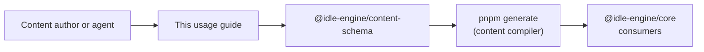

This guide turns the Content DSL specification into a step-by-step workflow for
authors and automation agents. It maps back to
`docs/content-dsl-usage-guidelines-design.md` and the schema behaviour in
`packages/content-schema/src/pack.ts`, so every directive stays tied to a
contract.

> Need deeper rationale? Read
> [`docs/content-dsl-schema-design.md`](content-dsl-schema-design.md),
> [`docs/content-compiler-design.md`](content-compiler-design.md), and inspect
> the canonical examples in `packages/content-sample`.

## Pipeline Overview

Authoring flows follow the same control points that the compiler and CLI
enforce:



The rest of this document walks the pipeline stage-by-stage with checklists,
examples, and validation hooks.

## Pack Scaffolding

Start from the structure maintained in `packages/content-sample`:

- Authoring sources live in `content/pack.json` (or `.json5` when comments help).
- Compiler outputs land in `content/compiled/` and `src/generated/` via
  `pnpm generate` and `tools/content-schema-cli/src/generate.js`.
- Runtime-facing re-exports live in `src/index.ts`, mirroring
  `packages/content-sample/src/index.ts`.

### Author checklist

- [ ] Create a new workspace package (for example `packages/<pack-slug>`) with a
  `content/` directory that mirrors the layout in
  `packages/content-sample/README.md`.
- [ ] Copy the latest `pnpm` scripts and TypeScript config from the sample pack
  so `pnpm generate`, `pnpm lint`, and tests stay aligned.
- [ ] Treat `content/compiled/` and `src/generated/` as generated outputs—never
  hand-edit them; always re-run `pnpm generate` after source edits.
- [ ] Commit the generated artifacts alongside `content/pack.json` so consumers
  never regenerate during install.

## Naming Conventions

The schema enforces naming through `packSlugSchema`, `contentIdSchema`, and
related validators (see `packages/content-schema/src/pack.ts`). Keep these rules
in mind before you run validation:

- `metadata.id`: lowercase slug (`a-z0-9-`), ≤32 chars, and stable after publish
  (`docs/content-dsl-schema-design.md` §5.5).
- Content IDs: reuse the slug casing from `contentIdSchema` and prefix with the
  pack slug to avoid collisions (`packages/content-schema/src/pack.ts`).
- `metadata.title` / `summary`: provide `default` copy and locale variants; keep
  `summary` ≤512 chars (`docs/content-dsl-schema-design.md` §5.5).
- `metadata.tags`: slug list (≤24 chars) with no spaces or uppercase characters
  (`docs/content-dsl-schema-design.md` §5.5).

### Naming checklist

- [ ] Pick a pack slug that matches the directory name and stays unique across
  `packages/*` (collisions surface via `ContentSchemaOptions.knownPacks` in
  `packages/content-schema/src/pack.ts`).
- [ ] Reserve a namespace prefix for content IDs before authoring modules and
  apply it consistently.
- [ ] Populate localized titles and summaries while setting `defaultLocale` and
  `supportedLocales` to avoid churn later.
- [ ] Document non-obvious tags or visibility flags in the package README so
  reviewers capture intent.

## Declaring Dependencies

Model relationships through `metadata.dependencies`:

- `requires`: hard dependencies that must be installed and activated first.
- `optional`: soft integrations flagged as warnings when missing (requires
  `ContentSchemaOptions.activePackIds` during validation).
- `conflicts`: mutually exclusive packs that should never load together.
- `provides`: capability slugs that downstream tooling can query.

Normalization deduplicates entries, sorts them, and blocks self-references (see
`docs/content-dsl-schema-design.md` §5.5 and
`packages/content-schema/src/modules/dependencies.ts`).

### Dependency checklist

- [ ] List every runtime prerequisite under `metadata.dependencies.requires`
  with a SemVer range that matches the dependency’s `metadata.version`.
- [ ] Mark optional integrations only when the pack functions without them and
  add contextual `message` fields for conflicts so tooling can explain why.
- [ ] Update team installation manifests (if any) whenever you add a new hard
  dependency so validation inputs stay aligned.
- [ ] Re-run `pnpm generate` and confirm the CLI logs omit
  `content_pack.dependency_cycle` warnings.

### Dependency compatibility matrix

<!-- markdownlint-disable MD013 -->

| Policy | Applies When | Enforcement | References |
| --- | --- | --- | --- |
| `requires` | Pack cannot function without another pack | Validation fails on missing packs; compiler blocks compilation | `docs/content-dsl-schema-design.md` (§5.5), `docs/content-compiler-design.md` (§5.6) |
| `optional` | Integration enhances behaviour but is not mandatory | Emits warnings when absent if `ContentSchemaOptions.activePackIds` supplies the install graph | `docs/content-dsl-schema-design.md` (§5.5), `packages/content-schema/src/modules/dependencies.ts` |
| `conflicts` | Packs must never load together | Validation errors guard against self-dependency; compiler logs failure with the conflicting slug | `docs/content-dsl-schema-design.md` (§5.5), `docs/content-compiler-design.md` (§5.6) |
| `provides` | Pack exposes capabilities for discovery tooling | Normalisation deduplicates entries; workspace summary records capability digests | `docs/content-dsl-schema-design.md` (§5.5), `docs/content-compiler-design.md` (§5.4) |

<!-- markdownlint-restore -->

## Versioning & Release Cadence

Content packs carry both a pack version and a runtime compatibility range:

- `metadata.version` must follow [Semantic Versioning](https://semver.org/) and
  increments whenever pack behaviour or data changes.
- `metadata.engine` expresses supported engine versions; validation uses
  `semver.satisfies()` and the feature gates in
  `packages/content-schema/src/runtime-compat.ts`.
- Compiler summaries (`src/generated/*summary*` in the sample pack) surface the
  slug, version, and warning count at import time
  (`packages/content-sample/src/index.ts:23-44`).

### Versioning checklist

- [ ] Bump `metadata.version` for every committed change that alters gameplay,
  data tables, or compatibility metadata.
- [ ] Align `metadata.engine` with the runtime tested locally (for example
  `>=0.4.0 <0.6.0`); widen ranges only after validating against newer runtimes.
- [ ] Capture notable changes in your package README or release notes so other
  authors can plan migrations.
- [ ] Inspect the generated summary module to confirm the digest and artifact
  hash changed when expected; unexpected stability often means missing source
  diffs.

## Compatibility Triage

Feature gates keep packs aligned with runtime capabilities. The current baseline
lives in `packages/content-schema/src/runtime-compat.ts`:

| Module | Introduced in | Documentation |
| --- | --- | --- |
| `automations` | `0.2.0` | `docs/idle-engine-design.md` (§9, §18) |
| `transforms` | `0.3.0` | `docs/idle-engine-design.md` (§6) |
| `runtimeEvents` | `0.3.0` | `docs/runtime-event-pubsub-design.md` |
| `prestigeLayers` | `0.4.0` | `docs/idle-engine-design.md` (§6, §18) |
| `guildPerks` | `0.5.0` | `docs/idle-engine-design.md` (§18) |

When `metadata.engine` omits or predates the required version, validation pushes
structured `FeatureViolation` errors or warnings (see
`resolveFeatureViolations` in `packages/content-schema/src/runtime-compat.ts`).

### Compatibility checklist

- [ ] Set `metadata.engine` before authoring gated modules so compatibility
  errors appear during `pnpm generate`.
- [ ] Treat feature-gate warnings (`severity: warning`) as TODOs—either upgrade
  the runtime target or trim gated modules before shipping.
- [ ] Include CLI logs from `pnpm generate` in review artifacts whenever
  compatibility adjustments are part of the change.
- [ ] If runtime contracts evolve, update this table and the pack metadata in
  the same pull request to avoid drift.

### Migration matrix

Use this matrix to plan schema evolution and pack migrations in lockstep with
the compiler and runtime guardrails described in the design docs.

<!-- markdownlint-disable MD013 -->

| Scenario | Expected action | References |
| --- | --- | --- |
| Schema fields added or behaviour changes | Run `pnpm generate` and revalidate packs; document the change in package README and update `metadata.version` to track the migration | `docs/content-dsl-schema-design.md` (§1, §5.5), `docs/content-compiler-design.md` (§5.5) |
| Dependency graph updates (new `requires` / `optional` edges) | Refresh installation manifests, rerun validation with updated `knownPacks`, and capture any new warnings in CLI logs | `docs/content-dsl-schema-design.md` (§5.5), `docs/content-compiler-design.md` (§5.6) |
| Runtime feature gates evolve | Synchronise this guide’s tables with `packages/content-schema/src/runtime-compat.ts`, adjust `metadata.engine`, and rerun schema tests to confirm compatibility | `packages/content-schema/src/runtime-compat.ts`, `docs/content-dsl-schema-design.md` (§5.5) |
| Compiler format version or digest rules change | Rebuild generated artifacts, inspect workspace summary digests, and note migration requirements in release notes | `docs/content-compiler-design.md` (§5.4-§5.5), `docs/content-dsl-schema-design.md` (§5.5) |

<!-- markdownlint-restore -->

## Reference Examples & Tooling

Use the sample pack as a living reference:

- `packages/content-sample/content/pack.json` illustrates metadata layout,
  dependency declarations, and module IDs.
- `packages/content-sample/src/generated/@idle-engine/sample-pack.generated.ts` shows the
  compiler outputs that should accompany every content change.
- `packages/content-sample/src/index.ts` demonstrates import-time guards that
  throw when compiler warnings slip through.

The CLI in `tools/content-schema-cli/src/generate.js` orchestrates validation,
manifest regeneration, and compilation. It emits structured
`content_pack.*` log lines—treat any new warning or error as a release blocker.

## Verification Runbook

Run these commands before requesting review:

```bash
pnpm generate
pnpm exec markdownlint docs/content-dsl-usage-guidelines.md
pnpm lint --filter @idle-engine/content-schema
```

If you modify shell UI flows or runtime contracts in parallel, extend the
checklist with the relevant test suites (for example `pnpm test --filter core`).

## See Also

- `docs/content-dsl-usage-guidelines-design.md` — rationale, scope, and
  acceptance criteria for this guide.
- `docs/content-dsl-schema-design.md` — field-level reference for the DSL.
- `docs/content-compiler-design.md` — details on generated artifacts and
  summary modules.
- `packages/content-sample/README.md` — regeneration workflow and runtime
  manifest integration.
