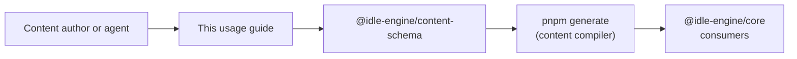

This guide turns the Content DSL specification into a step-by-step workflow for
authors and automation agents. It maps back to
`docs/content-dsl-usage-guidelines-design.md` and the schema behaviour in
`packages/content-schema/src/pack/index.ts`, so every directive stays tied to a
contract.

> Need deeper rationale? Read
> [`docs/content-dsl-schema-design.md`](content-dsl-schema-design.md),
> [`docs/content-compiler-design.md`](content-compiler-design.md), and inspect
> the canonical examples in `packages/content-sample`.

## Pipeline Overview

Authoring flows follow the same control points that the compiler and CLI
enforce:



The rest of this document walks the pipeline stage-by-stage with checklists,
examples, and validation hooks.

## Pack Scaffolding

Start from the structure maintained in `packages/content-sample`:

- Authoring sources live in `content/pack.json` (or `.json5` when comments help).
- Compiler outputs land in `content/compiled/` and `src/generated/` via
  `pnpm generate` and `tools/content-schema-cli/src/generate.js`.
- Runtime-facing re-exports live in `src/index.ts`, mirroring
  `packages/content-sample/src/index.ts`.

### Author checklist

- [ ] Create a new workspace package (for example `packages/<pack-slug>`) with a
  `content/` directory that mirrors the layout in
  `packages/content-sample/README.md`.
- [ ] Copy the latest `pnpm` scripts and TypeScript config from the sample pack
  so `pnpm generate`, `pnpm lint`, and tests stay aligned.
- [ ] Treat `content/compiled/` and `src/generated/` as generated outputs—never
  hand-edit them; always re-run `pnpm generate` after source edits.
- [ ] Commit the generated artifacts alongside `content/pack.json` so consumers
  never regenerate during install.

### Sample pack (prestige + balance) reference

The reference pack in `packages/content-sample/content/pack.json` embodies the
expanded economy and prestige layer described in
[`docs/sample-pack-balance-validation-design-issue-420.md`](sample-pack-balance-validation-design-issue-420.md).
Use it as a template when authoring or validating new packs:

- **Resources**: Energy (starts at 10), Crystal (hard currency, unlocks at
  Energy ≥ 25), Alloy (tier 2, unlocks at Crystal ≥ 50), Data Core (tier 2,
  unlocks at Alloy ≥ 40), and Prestige Flux (prestige-only, hidden until the
  prestige layer unlocks).
- **Generators**: Reactor (Energy), Crystal Harvester (consumes Energy), Forge
  (consumes Energy + Crystal → Alloy, linear cost: base 75, slope 12), Research
  Lab (consumes Energy + Alloy → Data Core, exponential cost: base 120,
  growth 1.12), and Gate Reactor (consumes Data Core → Prestige Flux; only
  visible/unlocked after prestige).
- **Upgrades**: Multi-tier reactor line (Insulation → Overclock → Phase
  Cooling), harvester line with repeatable Quantum Sieve, forge cost/rate tuning
  (Heat Shield, Auto-Feed), lab rate boosts (Insight Boost + repeatable
  Simulation Stack gated on Prestige Flux), and the prestige-centric Ascension
  Surge multiplier.
- **Prestige layer**: `sample-pack.ascension-alpha` unlocks at Data Core ≥ 500
  and Reactor level ≥ 10, resets base resources/generators/upgrades, and grants
  Prestige Flux via a clamped reward formula
  (`floor((energy + crystal + 2 * data-core) / 750)` capped to 1–5000). A
  minimum of 1 Prestige Flux is retained after each reset.

## Content Authoring Guide

This section adds field-level guidance, examples, and patterns for each content
type. Examples use the `@idle-engine/content-schema` factory helpers from
`packages/content-schema/src/factories.ts` when authoring in TypeScript, but the
same shapes work inside `content/pack.json`.

### Authoring with TypeScript factories

When you want type-safe authoring in code, import the factories and build the
objects you later embed in a pack definition:

```typescript
import {
  createResource,
  createGenerator,
  createUpgrade,
} from '@idle-engine/content-schema/factories';

const energy = createResource({
  id: 'docs-minimal.energy',
  name: { default: 'Energy' },
  category: 'currency',
  tier: 1,
});
```

### Content type reference

Each section includes required fields, optional fields (with defaults), and
minimal/complete examples.

#### Resources

**Purpose**: Declare currencies and materials tracked by the runtime.

Required fields:

| Field | Type | Notes |
| --- | --- | --- |
| `id` | `ContentId` | Must be globally unique (prefix with pack slug). |
| `name` | `LocalizedText` | Localized display name. |
| `category` | `primary` \| `prestige` \| `automation` \| `currency` \| `misc` | Controls grouping and semantics. |
| `tier` | `number` | Positive integer tier. |

Optional fields (defaults in parentheses):

| Field | Type | Notes |
| --- | --- | --- |
| `economyClassification` (`soft`) | `hard` \| `soft` | Use `hard` for premium currency. |
| `icon` | `string` | Asset path. |
| `startAmount` (`0`) | `number` | Initial amount. |
| `capacity` (`null`) | `number \| null` | `null` means no cap. |
| `visible` (`true`) | `boolean` | Controls default visibility. |
| `unlocked` (`false`) | `boolean` | Unlock state at start. |
| `dirtyTolerance` | `number` | Optional numeric precision threshold. |
| `order` | `number` | Sort ordering within UI. |
| `unlockCondition` | `Condition` | Becomes monotonic. |
| `visibilityCondition` | `Condition` | Evaluated each tick. |
| `prestige` | `{ layerId, resetRetention? }` | Retention for prestige-layer resources. |
| `tags` (`[]`) | `string[]` | Normalized, lowercased. |

Minimal example:

```json
{
  "id": "docs-minimal.energy",
  "name": { "default": "Energy" },
  "category": "currency",
  "tier": 1
}
```

Complete example:

```json
{
  "id": "docs-prestige.prestige-points",
  "name": { "default": "Prestige Points" },
  "category": "prestige",
  "economyClassification": "soft",
  "tier": 3,
  "icon": "icons/prestige-points.svg",
  "startAmount": 0,
  "capacity": null,
  "visible": false,
  "unlocked": false,
  "unlockCondition": {
    "kind": "prestigeUnlocked",
    "prestigeLayerId": "docs-prestige.rebirth"
  },
  "visibilityCondition": {
    "kind": "prestigeUnlocked",
    "prestigeLayerId": "docs-prestige.rebirth"
  },
  "prestige": {
    "layerId": "docs-prestige.rebirth",
    "resetRetention": { "kind": "constant", "value": 1 }
  },
  "order": 30,
  "tags": ["prestige", "core"]
}
```

#### Entities

**Purpose**: Declare units/heroes/NPCs tracked by the runtime (optionally with per-instance identity, stats, and progression).

Required fields:

| Field | Type | Notes |
| --- | --- | --- |
| `id` | `ContentId` | Entity identifier. |
| `name` | `LocalizedText` | Display name. |
| `description` | `LocalizedSummary` | Short description. |
| `stats` | `{ id, name, baseValue, minValue?, maxValue? }[]` | At least one stat. |

Optional fields (defaults in parentheses):

| Field | Type | Notes |
| --- | --- | --- |
| `maxCount` | `NumericFormula` | Total entity cap (count or instances). |
| `startCount` (`0`) | `number` | Starting count, or starting instances when `trackInstances: true`. |
| `trackInstances` (`false`) | `boolean` | When `true`, runtime tracks individual instances (levels/stats/mission assignments). |
| `progression` | `{ experienceResource?, levelFormula, maxLevel?, statGrowth }` | Enables XP/levels and per-level stat growth. |
| `unlockCondition` | `Condition` | If omitted, the entity starts unlocked. |
| `visibilityCondition` | `Condition` | If omitted, uses `visible`. |
| `unlocked` (`false`) | `boolean` | When `unlockCondition` is present, `unlocked: true` starts it unlocked anyway. |
| `visible` (`true`) | `boolean` | Default visibility. |
| `tags` (`[]`) | `string[]` | Normalized, lowercased. |
| `order` | `number` | UI ordering. |

Minimal example:

```json
{
  "id": "docs-minimal.scout",
  "name": { "default": "Scout" },
  "description": { "default": "A basic explorer." },
  "stats": [
    {
      "id": "docs-minimal.scout.speed",
      "name": { "default": "Speed" },
      "baseValue": { "kind": "constant", "value": 1 }
    }
  ]
}
```

Complete example:

```json
{
  "id": "docs-missions.scout",
  "name": { "default": "Scout" },
  "description": { "default": "A recruitable unit used in missions." },
  "stats": [
    {
      "id": "docs-missions.scout.power",
      "name": { "default": "Power" },
      "baseValue": { "kind": "constant", "value": 5 },
      "minValue": { "kind": "constant", "value": 0 }
    },
    {
      "id": "docs-missions.scout.luck",
      "name": { "default": "Luck" },
      "baseValue": { "kind": "constant", "value": 0.1 },
      "minValue": { "kind": "constant", "value": 0 },
      "maxValue": { "kind": "constant", "value": 1 }
    }
  ],
  "maxCount": { "kind": "constant", "value": 5 },
  "startCount": 2,
  "trackInstances": true,
  "progression": {
    "experienceResource": "docs-missions.scout-xp",
    "levelFormula": { "kind": "linear", "base": 0, "slope": 10 },
    "maxLevel": 20,
    "statGrowth": {
      "docs-missions.scout.power": { "kind": "constant", "value": 0.5 }
    }
  },
  "unlockCondition": { "kind": "always" },
  "order": 40,
  "tags": ["units", "missions"]
}
```

#### Generators

**Purpose**: Define producers that convert time into resources.

Required fields:

| Field | Type | Notes |
| --- | --- | --- |
| `id` | `ContentId` | Generator identifier. |
| `name` | `LocalizedText` | Display name. |
| `produces` | `{ resourceId, rate }[]` | At least one entry. |
| `purchase` | `SingleCurrencyPurchase \| MultiCurrencyPurchase` | Cost model. |
| `baseUnlock` | `Condition` | When generator becomes available. |

Optional fields (defaults in parentheses):

| Field | Type | Notes |
| --- | --- | --- |
| `icon` | `string` | Asset path. |
| `tags` (`[]`) | `string[]` | Categorization tags. |
| `consumes` (`[]`) | `{ resourceId, rate }[]` | Resource drains. |
| `initialLevel` (`0`) | `number` | Starting level. |
| `maxLevel` | `number` | Level cap. |
| `order` | `number` | UI ordering. |
| `visibilityCondition` | `Condition` | UI-only visibility. |
| `automation` | `{ automationId }` | Link to automation unlock. |
| `effects` (`[]`) | `UpgradeEffect[]` | Effects applied per level. |

Minimal example:

```json
{
  "id": "docs-minimal.ticker",
  "name": { "default": "Ticker" },
  "produces": [
    { "resourceId": "docs-minimal.energy", "rate": { "kind": "constant", "value": 1 } }
  ],
  "purchase": {
    "currencyId": "docs-minimal.energy",
    "costMultiplier": 10,
    "costCurve": { "kind": "constant", "value": 1 }
  },
  "baseUnlock": { "kind": "always" }
}
```

Complete example:

```json
{
  "id": "docs-prestige.core",
  "name": { "default": "Core" },
  "icon": "icons/core.svg",
  "tags": ["primary"],
  "produces": [
    { "resourceId": "docs-prestige.energy", "rate": { "kind": "linear", "base": 1, "slope": 0.5 } }
  ],
  "consumes": [],
  "purchase": {
    "currencyId": "docs-prestige.energy",
    "costMultiplier": 25,
    "costCurve": { "kind": "exponential", "growth": 1.15 }
  },
  "initialLevel": 0,
  "maxLevel": 50,
  "order": 10,
  "baseUnlock": { "kind": "always" },
  "visibilityCondition": { "kind": "always" },
  "effects": [
    {
      "kind": "modifyResourceRate",
      "resourceId": "docs-prestige.energy",
      "operation": "add",
      "value": { "kind": "constant", "value": 0.25 }
    }
  ]
}
```

#### Upgrades

**Purpose**: One-time or repeatable modifiers tied to targets.

Required fields:

| Field | Type | Notes |
| --- | --- | --- |
| `id` | `ContentId` | Upgrade identifier. |
| `name` | `LocalizedText` | Display name. |
| `category` | `global` \| `resource` \| `generator` \| `automation` \| `prestige` | Organization label. |
| `targets` | `UpgradeTarget[]` | At least one target. |
| `cost` | `SingleCurrencyCost \| MultiCurrencyCost` | Purchase cost. |
| `effects` | `UpgradeEffect[]` | At least one effect. |

Optional fields (defaults in parentheses):

| Field | Type | Notes |
| --- | --- | --- |
| `icon` | `string` | Asset path. |
| `tags` (`[]`) | `string[]` | Categorization. |
| `repeatable` | `{ maxPurchases?, costCurve?, effectCurve? }` | Progression tuning. |
| `prerequisites` (`[]`) | `Condition[]` | Strings become `upgradeOwned`. |
| `order` | `number` | UI ordering. |
| `unlockCondition` | `Condition` | Unlock gating. |
| `visibilityCondition` | `Condition` | UI-only visibility. |

Minimal example:

```json
{
  "id": "docs-prestige.core-efficiency",
  "name": { "default": "Core Efficiency" },
  "category": "generator",
  "targets": [{ "kind": "generator", "id": "docs-prestige.core" }],
  "cost": {
    "currencyId": "docs-prestige.energy",
    "costMultiplier": 100,
    "costCurve": { "kind": "constant", "value": 1 }
  },
  "effects": [
    {
      "kind": "modifyGeneratorRate",
      "generatorId": "docs-prestige.core",
      "operation": "multiply",
      "value": { "kind": "constant", "value": 1.25 }
    }
  ]
}
```

Complete example:

```json
{
  "id": "docs-prestige.core-efficiency-ii",
  "name": { "default": "Core Efficiency II" },
  "icon": "icons/upgrade-core.svg",
  "tags": ["core", "efficiency"],
  "category": "generator",
  "targets": [{ "kind": "generator", "id": "docs-prestige.core" }],
  "cost": {
    "costs": [
      {
        "resourceId": "docs-prestige.energy",
        "costMultiplier": 250,
        "costCurve": { "kind": "linear", "base": 1, "slope": 0.2 }
      }
    ]
  },
  "repeatable": {
    "maxPurchases": 10,
    "costCurve": { "kind": "exponential", "growth": 1.1 },
    "effectCurve": { "kind": "linear", "base": 1, "slope": 0.05 }
  },
  "prerequisites": ["docs-prestige.core-efficiency"],
  "order": 20,
  "unlockCondition": {
    "kind": "resourceThreshold",
    "resourceId": "docs-prestige.energy",
    "comparator": "gte",
    "amount": { "kind": "constant", "value": 500 }
  },
  "effects": [
    {
      "kind": "modifyGeneratorRate",
      "generatorId": "docs-prestige.core",
      "operation": "multiply",
      "value": { "kind": "linear", "base": 1, "slope": 0.1 }
    },
    {
      "kind": "unlockGenerator",
      "generatorId": "docs-prestige.shard-miner"
    }
  ]
}
```

#### Achievements

**Purpose**: Track progress milestones and award rewards.

Required fields:

| Field | Type | Notes |
| --- | --- | --- |
| `id` | `ContentId` | Achievement identifier. |
| `name` | `LocalizedText` | Display name. |
| `description` | `LocalizedSummary` | Short description. |
| `category` | `progression` \| `prestige` \| `automation` \| `collection` | Classification. |
| `tier` | `bronze` \| `silver` \| `gold` \| `platinum` | Presentation tier. |
| `track` | `AchievementTrack` | Progress source. |

Optional fields (defaults in parentheses):

| Field | Type | Notes |
| --- | --- | --- |
| `icon` | `string` | Asset path. |
| `tags` (`[]`) | `string[]` | Categorization. |
| `progress` (`{ mode: "oneShot" }`) | `{ mode, target?, repeatable? }` | Defaults target from track. |
| `reward` | `AchievementReward` | Optional award. |
| `unlockCondition` | `Condition` | Unlock gating. |
| `visibilityCondition` | `Condition` | UI-only visibility. |
| `onUnlockEvents` (`[]`) | `ContentId[]` | Emits runtime events. |
| `displayOrder` | `number` | UI ordering. |

Minimal example:

```json
{
  "id": "docs-prestige.first-energy",
  "name": { "default": "First Spark" },
  "description": { "default": "Generate your first energy." },
  "category": "progression",
  "tier": "bronze",
  "track": {
    "kind": "resource",
    "resourceId": "docs-prestige.energy",
    "comparator": "gte",
    "threshold": { "kind": "constant", "value": 1 }
  }
}
```

Complete example:

```json
{
  "id": "docs-prestige.energy-hoarder",
  "name": { "default": "Energy Hoarder" },
  "description": { "default": "Store 1,000 energy without spending it." },
  "category": "progression",
  "tier": "silver",
  "icon": "icons/achievement-energy.svg",
  "tags": ["energy"],
  "track": {
    "kind": "resource",
    "resourceId": "docs-prestige.energy",
    "comparator": "gte",
    "threshold": { "kind": "constant", "value": 1000 }
  },
  "progress": {
    "mode": "repeatable",
    "repeatable": {
      "resetWindow": { "kind": "constant", "value": 60 },
      "maxRepeats": 3,
      "rewardScaling": { "kind": "linear", "base": 1, "slope": 0.5 }
    }
  },
  "reward": {
    "kind": "grantResource",
    "resourceId": "docs-prestige.energy",
    "amount": { "kind": "constant", "value": 50 }
  },
  "onUnlockEvents": ["docs-prestige.achievement.energy-hoarder"]
}
```

#### Automations

**Purpose**: Encode auto-play behaviors (buy, collect, system actions).

Required fields:

| Field | Type | Notes |
| --- | --- | --- |
| `id` | `ContentId` | Automation identifier. |
| `name` | `LocalizedText` | Display name. |
| `description` | `LocalizedText` | Description text. |
| `targetType` | `generator` \| `upgrade` \| `purchaseGenerator` \| `collectResource` \| `system` | Operation type. |
| `trigger` | `AutomationTrigger` | Interval/resource/event trigger. |
| `unlockCondition` | `Condition` | Unlock gating. |

Conditional required fields:

| Field | Applies when | Notes |
| --- | --- | --- |
| `targetId` | `targetType !== "system"` | Required for non-system targets. |
| `systemTargetId` | `targetType === "system"` | Required for system targets. |

Optional fields (defaults in parentheses):

| Field | Type | Notes |
| --- | --- | --- |
| `targetEnabled` | `boolean` | Only for generator targets. |
| `targetCount` | `NumericFormula` | Only for `purchaseGenerator`. |
| `targetAmount` | `NumericFormula` | Only for `collectResource`. |
| `cooldown` | `NumericFormula` | Post-success cooldown. |
| `resourceCost` | `{ resourceId, rate }` | Cost per activation. |
| `visibilityCondition` | `Condition` | UI-only visibility. |
| `enabledByDefault` (`false`) | `boolean` | Initial toggle state. |
| `order` | `number` | UI ordering. |
| `scriptId` | `ScriptId` | Script integration. |

Minimal example:

```json
{
  "id": "docs-prestige.auto-core",
  "name": { "default": "Auto Core" },
  "description": { "default": "Automatically purchase cores." },
  "targetType": "purchaseGenerator",
  "targetId": "docs-prestige.core",
  "targetCount": { "kind": "constant", "value": 1 },
  "trigger": { "kind": "interval", "interval": { "kind": "constant", "value": 10 } },
  "unlockCondition": { "kind": "always" }
}
```

Complete example:

```json
{
  "id": "docs-prestige.auto-collect",
  "name": { "default": "Auto Collect" },
  "description": { "default": "Collect shards when the queue is empty." },
  "targetType": "collectResource",
  "targetId": "docs-prestige.shards",
  "targetAmount": { "kind": "constant", "value": 5 },
  "trigger": { "kind": "commandQueueEmpty" },
  "cooldown": { "kind": "constant", "value": 15 },
  "resourceCost": {
    "resourceId": "docs-prestige.energy",
    "rate": { "kind": "constant", "value": 2 }
  },
  "unlockCondition": {
    "kind": "resourceThreshold",
    "resourceId": "docs-prestige.energy",
    "comparator": "gte",
    "amount": { "kind": "constant", "value": 50 }
  },
  "visibilityCondition": { "kind": "always" },
  "enabledByDefault": false,
  "order": 40
}
```

#### Prestige layers

**Purpose**: Define reset mechanics and prestige rewards.

> **Note**: Every prestige layer requires a counter resource named `{id}-prestige-count` (for example `docs-prestige.rebirth-prestige-count`) in the pack's `resources` array. The runtime increments this resource each time the layer is applied, and conditions like `prestigeCompleted` / `prestigeCountThreshold` read it—do not include it in `resetTargets`.

Minimal prestige counter resource example:

```json
{
  "id": "docs-prestige.rebirth-prestige-count",
  "name": { "default": "Rebirth Count" },
  "category": "misc",
  "tier": 3,
  "startAmount": 0,
  "visible": false,
  "unlocked": true
}
```

Required fields:

| Field | Type | Notes |
| --- | --- | --- |
| `id` | `ContentId` | Layer identifier. |
| `name` | `LocalizedText` | Display name. |
| `summary` | `LocalizedText` | Short summary. |
| `resetTargets` | `ContentId[]` | Resources to reset (at least one). |
| `unlockCondition` | `Condition` | When prestige becomes available. |
| `reward` | `{ resourceId, baseReward, multiplierCurve? }` | Reward formula. |

Optional fields (defaults in parentheses):

| Field | Type | Notes |
| --- | --- | --- |
| `icon` | `string` | Asset path. |
| `resetGenerators` | `ContentId[]` | Generators to reset. |
| `resetUpgrades` | `ContentId[]` | Upgrades to reset. |
| `retention` (`[]`) | `{ kind, ... }[]` | Items retained after reset. |
| `automation` | `{ automationId }` | Link to automation. |
| `order` | `number` | UI ordering. |

Minimal example:

```json
{
  "id": "docs-prestige.rebirth",
  "name": { "default": "Rebirth" },
  "summary": { "default": "Reset for prestige points." },
  "resetTargets": ["docs-prestige.energy", "docs-prestige.shards"],
  "unlockCondition": {
    "kind": "resourceThreshold",
    "resourceId": "docs-prestige.shards",
    "comparator": "gte",
    "amount": { "kind": "constant", "value": 100 }
  },
  "reward": {
    "resourceId": "docs-prestige.prestige-points",
    "baseReward": { "kind": "constant", "value": 1 }
  }
}
```

Complete example:

```json
{
  "id": "docs-prestige.rebirth-plus",
  "name": { "default": "Rebirth +" },
  "summary": { "default": "Stronger resets with retention." },
  "icon": "icons/rebirth.svg",
  "resetTargets": ["docs-prestige.energy", "docs-prestige.shards"],
  "resetGenerators": ["docs-prestige.core", "docs-prestige.shard-miner"],
  "resetUpgrades": ["docs-prestige.core-efficiency"],
  "unlockCondition": {
    "kind": "generatorLevel",
    "generatorId": "docs-prestige.core",
    "comparator": "gte",
    "level": { "kind": "constant", "value": 10 }
  },
  "reward": {
    "resourceId": "docs-prestige.prestige-points",
    "baseReward": { "kind": "constant", "value": 2 },
    "multiplierCurve": { "kind": "linear", "base": 1, "slope": 0.5 }
  },
  "retention": [
    {
      "kind": "resource",
      "resourceId": "docs-prestige.energy",
      "amount": { "kind": "constant", "value": 50 }
    }
  ],
  "order": 60
}
```

#### Metrics

**Purpose**: Instrument runtime or content-driven counters/gauges.

Required fields:

| Field | Type | Notes |
| --- | --- | --- |
| `id` | `ContentId` | Metric identifier. |
| `name` | `LocalizedText` | Display name. |
| `kind` | `counter` \| `gauge` \| `histogram` \| `upDownCounter` | Metric shape. |
| `source` | `runtime` \| `content` \| `script` | Origin of updates. |

Optional fields (defaults in parentheses):

| Field | Type | Notes |
| --- | --- | --- |
| `description` | `LocalizedSummary` | Text for dashboards. |
| `unit` (`"1"`) | `string` | Unit label. |
| `aggregation` | `sum` \| `delta` \| `cumulative` \| `distribution` | Required for histograms. |
| `attributes` (`[]`) | `string[]` | `<= 3` recommended. |
| `order` | `number` | UI ordering. |

Minimal example:

```json
{
  "id": "docs-prestige.total-energy",
  "name": { "default": "Total Energy" },
  "kind": "counter",
  "source": { "kind": "runtime" }
}
```

Complete example:

```json
{
  "id": "docs-prestige.energy-rate",
  "name": { "default": "Energy Rate" },
  "description": { "default": "Energy per second over time." },
  "kind": "histogram",
  "unit": "energy/s",
  "aggregation": "distribution",
  "attributes": ["source", "tier"],
  "source": { "kind": "content" },
  "order": 70
}
```

#### Transforms

**Purpose**: Define conversion recipes and crafting steps.

Required fields:

| Field | Type | Notes |
| --- | --- | --- |
| `id` | `ContentId` | Transform identifier. |
| `name` | `LocalizedText` | Display name. |
| `description` | `LocalizedSummary` | Short description. |
| `mode` | `instant` \| `continuous` \| `batch` \| `mission` | Execution mode. |
| `inputs` | `{ resourceId, amount }[]` | At least one input. |
| `outputs` | `{ resourceId, amount }[]` | Non-mission transforms must have at least one output; mission transforms use `outcomes.*.outputs` and may set this to `[]`. |
| `trigger` | `TransformTrigger` | Manual, automation, condition, or event. |

Optional fields (defaults in parentheses):

| Field | Type | Notes |
| --- | --- | --- |
| `duration` | `NumericFormula` | Duration in milliseconds. Required for `batch` mode and single-stage mission transforms. |
| `cooldown` | `NumericFormula` | Cooldown in milliseconds between runs. |
| `unlockCondition` | `Condition` | Unlock gating. |
| `visibilityCondition` | `Condition` | UI-only visibility. |
| `automation` | `{ automationId }` | Required for automation trigger. |
| `tags` (`[]`) | `string[]` | Categorization. |
| `safety` | `{ maxRunsPerTick?, maxOutstandingBatches? }` | Runtime guardrails. |
| `order` | `number` | UI ordering. |

Mission-only fields (when `mode: "mission"`):

| Field | Type | Notes |
| --- | --- | --- |
| `entityRequirements` | `{ entityId, count, minStats?, preferHighStats?, returnOnComplete? }[]` | Required; selects entity instances for deployment. |
| `successRate` | `{ baseRate, statModifiers?, usePRD? }` | Optional; if omitted, missions always succeed. |
| `outcomes` | `{ success, failure?, critical? }` | Required; mission rewards (and optional entity XP/damage). |
| `stages` | `MissionStage[]` | Optional; define multi-stage missions with checkpoints/decisions. |
| `initialStage` | `string` | Optional; defaults to the first stage when `stages` is present. |

Minimal example:

```json
{
  "id": "docs-prestige.refine-shards",
  "name": { "default": "Refine Shards" },
  "description": { "default": "Convert energy into shards." },
  "mode": "instant",
  "inputs": [{ "resourceId": "docs-prestige.energy", "amount": { "kind": "constant", "value": 10 } }],
  "outputs": [{ "resourceId": "docs-prestige.shards", "amount": { "kind": "constant", "value": 1 } }],
  "trigger": { "kind": "manual" }
}
```

Complete example:

```json
{
  "id": "docs-prestige.batch-refine",
  "name": { "default": "Batch Refinery" },
  "description": { "default": "Process larger shard batches over time." },
  "mode": "batch",
  "inputs": [{ "resourceId": "docs-prestige.energy", "amount": { "kind": "constant", "value": 50 } }],
  "outputs": [{ "resourceId": "docs-prestige.shards", "amount": { "kind": "constant", "value": 8 } }],
  "duration": { "kind": "constant", "value": 15000 },
  "cooldown": { "kind": "constant", "value": 10000 },
  "trigger": {
    "kind": "condition",
    "condition": {
      "kind": "resourceThreshold",
      "resourceId": "docs-prestige.energy",
      "comparator": "gte",
      "amount": { "kind": "constant", "value": 50 }
    }
  },
  "unlockCondition": { "kind": "always" },
  "safety": { "maxRunsPerTick": 5, "maxOutstandingBatches": 20 },
  "order": 80
}
```

Mission example (multi-stage with a decision):

```json
{
  "id": "docs-missions.forest-expedition",
  "name": { "default": "Forest Expedition" },
  "description": { "default": "Send scouts to explore the forest." },
  "mode": "mission",
  "inputs": [{ "resourceId": "docs-missions.supplies", "amount": { "kind": "constant", "value": 2 } }],
  "outputs": [],
  "trigger": { "kind": "manual" },
  "entityRequirements": [
    {
      "entityId": "docs-missions.scout",
      "count": { "kind": "constant", "value": 2 },
      "preferHighStats": ["docs-missions.scout.luck"]
    }
  ],
  "successRate": {
    "baseRate": { "kind": "constant", "value": 0.6 },
    "statModifiers": [
      {
        "stat": "docs-missions.scout.luck",
        "weight": { "kind": "constant", "value": 0.1 },
        "entityScope": "average"
      }
    ],
    "usePRD": true
  },
  "outcomes": {
    "success": {
      "outputs": [{ "resourceId": "docs-missions.loot", "amount": { "kind": "constant", "value": 5 } }],
      "entityExperience": { "kind": "constant", "value": 3 },
      "message": { "default": "The expedition returns with supplies." }
    },
    "failure": {
      "outputs": [],
      "entityDamage": { "kind": "constant", "value": 1 },
      "message": { "default": "The expedition returns empty-handed." }
    },
    "critical": {
      "chance": { "kind": "constant", "value": 0.1 },
      "outputs": [{ "resourceId": "docs-missions.loot", "amount": { "kind": "constant", "value": 15 } }],
      "entityExperience": { "kind": "constant", "value": 6 },
      "message": { "default": "Jackpot!" }
    }
  },
  "stages": [
    {
      "id": "travel",
      "name": { "default": "Travel" },
      "duration": { "kind": "constant", "value": 30000 },
      "checkpoint": {
        "outputs": [],
        "message": { "default": "Scouts reach the forest edge." }
      },
      "nextStage": "search"
    },
    {
      "id": "search",
      "name": { "default": "Search" },
      "duration": { "kind": "constant", "value": 60000 },
      "decision": {
        "prompt": { "default": "Take the safe path or a risky shortcut?" },
        "timeout": { "kind": "constant", "value": 15000 },
        "defaultOption": "safe",
        "options": [
          {
            "id": "safe",
            "label": { "default": "Safe path" },
            "nextStage": "return_safe",
            "modifiers": {
              "successRateBonus": { "kind": "constant", "value": 0.05 }
            }
          },
          {
            "id": "risky",
            "label": { "default": "Risky shortcut" },
            "nextStage": "return_risky",
            "modifiers": {
              "successRateBonus": { "kind": "constant", "value": -0.05 },
              "outputMultiplier": { "kind": "constant", "value": 1.5 }
            }
          }
        ]
      }
    },
    {
      "id": "return_safe",
      "name": { "default": "Return" },
      "duration": { "kind": "constant", "value": 30000 },
      "nextStage": null
    },
    {
      "id": "return_risky",
      "name": { "default": "Return (risky)" },
      "duration": { "kind": "constant", "value": 30000 },
      "nextStage": null
    }
  ]
}
```

### Conditions and formulas

Conditions and formulas are shared across content types. Keep them small and
deterministic to avoid hitting depth limits (`MAX_CONDITION_DEPTH`,
`MAX_FORMULA_DEPTH`).

#### Condition kinds

- `always` / `never` - unconditional gates.
- `resourceThreshold` - compare resource amount via `comparator` + `amount`.
- `generatorLevel` - compare generator level via `comparator` + `level`.
- `upgradeOwned` - require a number of purchases (defaults to 1).
- `prestigeCountThreshold` - compare prestige count with comparator + count.
- `prestigeCompleted` - true after at least one prestige reset.
- `prestigeUnlocked` - true while the prestige action is currently available.
- `flag` / `script` - driven by flags or scripts.
- `allOf` / `anyOf` / `not` - logical composition.

Example: multi-condition unlock

```json
{
  "kind": "allOf",
  "conditions": [
    {
      "kind": "resourceThreshold",
      "resourceId": "docs-prestige.energy",
      "comparator": "gte",
      "amount": { "kind": "constant", "value": 250 }
    },
    {
      "kind": "generatorLevel",
      "generatorId": "docs-prestige.core",
      "comparator": "gte",
      "level": { "kind": "constant", "value": 5 }
    }
  ]
}
```

**Prestige gotcha**: `prestigeUnlocked` means the layer is currently available,
not "post-prestige". Use `prestigeCompleted` or `prestigeCountThreshold` for
post-prestige gating.

#### Formula kinds

- `constant` - fixed numbers.
- `linear` - `base + slope * level`.
- `exponential` - `base * growth^level + offset`.
- `polynomial` - coefficient-based curves.
- `piecewise` - switch formulas by level.
- `expression` - custom expression trees (use sparingly).

Example: expression formula with references

```json
{
  "kind": "expression",
  "expression": {
    "kind": "binary",
    "op": "mul",
    "left": { "kind": "ref", "target": { "type": "variable", "name": "level" } },
    "right": { "kind": "literal", "value": 1.25 }
  }
}
```

### Effects system (upgrades + generator effects)

Effect operations:

- `add` - additive delta.
- `multiply` - multiplicative scale.
- `set` - override value.

Effect kinds:

- `modifyResourceRate`
- `modifyResourceCapacity`
- `modifyGeneratorRate`
- `modifyGeneratorCost`
- `modifyGeneratorConsumption`
- `grantAutomation`
- `grantFlag`
- `unlockResource`
- `unlockGenerator`
- `alterDirtyTolerance`
- `emitEvent`

Example: mix of resource and generator effects

```json
[
  {
    "kind": "modifyResourceRate",
    "resourceId": "docs-prestige.energy",
    "operation": "add",
    "value": { "kind": "constant", "value": 2 }
  },
  {
    "kind": "modifyGeneratorCost",
    "generatorId": "docs-prestige.core",
    "operation": "multiply",
    "value": { "kind": "constant", "value": 0.9 }
  }
]
```

### Authoring gotchas

- `unlockCondition` vs `visibilityCondition` (resources): if a resource starts
  `visible: false` and you never set a `visibilityCondition`, it stays hidden
  even after unlocking. Mirror the unlock condition when you expect it to
  reveal on unlock.
- Automations: non-`always` `unlockCondition`s are not evaluated by
  `AutomationSystem` today (see #502). Use upgrade effects and external wiring
  to enable these automations when needed.
- Prestige gating: use `prestigeCompleted` / `prestigeCountThreshold` for
  post-prestige gates; `prestigeUnlocked` is "available now" (see #505).

### Example packs

Reference packs live in `docs/examples/`:

- `docs/examples/minimal-pack/content/pack.json`
- `docs/examples/prestige-pack/content/pack.json`

Run `pnpm generate --check` to validate the examples alongside other packs.

For quick lookups, use the condensed cheat sheet in
`docs/content-quick-reference.md`.

## Naming Conventions

The schema enforces naming through `packSlugSchema`, `contentIdSchema`, and
related validators (see `packages/content-schema/src/pack/schema.ts`). Keep these rules
in mind before you run validation:

- `metadata.id`: lowercase slug (`a-z0-9-`), ≤32 chars, and stable after publish
  (`docs/content-dsl-schema-design.md` §5.5).
- Content IDs: reuse the slug casing from `contentIdSchema` and prefix with the
  pack slug to avoid collisions (`packages/content-schema/src/base/ids.ts`).
- `metadata.title` / `summary`: provide `default` copy and locale variants; keep
  `summary` ≤512 chars (`docs/content-dsl-schema-design.md` §5.5).
- `metadata.tags`: slug list (≤24 chars) with no spaces or uppercase characters
  (`docs/content-dsl-schema-design.md` §5.5).

### Naming checklist

- [ ] Pick a pack slug that matches the directory name and stays unique across
  `packages/*` (collisions surface via `ContentSchemaOptions.knownPacks` in
  `packages/content-schema/src/pack/types.ts`).
- [ ] Reserve a namespace prefix for content IDs before authoring modules and
  apply it consistently.
- [ ] Populate localized titles and summaries while setting `defaultLocale` and
  `supportedLocales` to avoid churn later.
- [ ] Document non-obvious tags or visibility flags in the package README so
  reviewers capture intent.

## Offline Progression Fast Path

Use `metadata.offlineProgression` to opt into constant-rate offline restores:

- Supply `mode: "constant-rates"` with `preconditions` (`constantRates`, `noUnlocks`, `noAchievements`, `noAutomation`, `modeledResourceBounds`).
- Omit the block if any precondition is false so restores fall back to step-based catch-up.

## Declaring Dependencies

Model relationships through `metadata.dependencies`:

- `requires`: hard dependencies that must be installed and activated first.
- `optional`: soft integrations flagged as warnings when missing (requires
  `ContentSchemaOptions.activePackIds` during validation).
- `conflicts`: mutually exclusive packs that should never load together.
- `provides`: capability slugs that downstream tooling can query.

Normalization deduplicates entries, sorts them, and blocks self-references (see
`docs/content-dsl-schema-design.md` §5.5 and
`packages/content-schema/src/modules/dependencies.ts`).

### Dependency checklist

- [ ] List every runtime prerequisite under `metadata.dependencies.requires`
  with a SemVer range that matches the dependency’s `metadata.version`.
- [ ] Mark optional integrations only when the pack functions without them and
  add contextual `message` fields for conflicts so tooling can explain why.
- [ ] Update team installation manifests (if any) whenever you add a new hard
  dependency so validation inputs stay aligned.
- [ ] Re-run `pnpm generate` and confirm the CLI logs omit
  `content_pack.dependency_cycle` warnings.

### Dependency compatibility matrix

<!-- markdownlint-disable MD013 -->

| Policy | Applies When | Enforcement | References |
| --- | --- | --- | --- |
| `requires` | Pack cannot function without another pack | Validation fails on missing packs; compiler blocks compilation | `docs/content-dsl-schema-design.md` (§5.5), `docs/content-compiler-design.md` (§5.6) |
| `optional` | Integration enhances behaviour but is not mandatory | Emits warnings when absent if `ContentSchemaOptions.activePackIds` supplies the install graph | `docs/content-dsl-schema-design.md` (§5.5), `packages/content-schema/src/modules/dependencies.ts` |
| `conflicts` | Packs must never load together | Validation errors guard against self-dependency; compiler logs failure with the conflicting slug | `docs/content-dsl-schema-design.md` (§5.5), `docs/content-compiler-design.md` (§5.6) |
| `provides` | Pack exposes capabilities for discovery tooling | Normalisation deduplicates entries; workspace summary records capability digests | `docs/content-dsl-schema-design.md` (§5.5), `docs/content-compiler-design.md` (§5.4) |

<!-- markdownlint-restore -->

## Versioning & Release Cadence

Content packs carry both a pack version and a runtime compatibility range:

- `metadata.version` must follow [Semantic Versioning](https://semver.org/) and
  increments whenever pack behaviour or data changes.
- `metadata.engine` expresses supported engine versions; validation uses
  `semver.satisfies()` and the feature gates in
  `packages/content-schema/src/runtime-compat.ts`.
- Compiler summaries (`src/generated/*summary*` in the sample pack) surface the
  slug, version, and warning count at import time
  (`packages/content-sample/src/index.ts:23-44`).

### Versioning checklist

- [ ] Bump `metadata.version` for every committed change that alters gameplay,
  data tables, or compatibility metadata.
- [ ] Align `metadata.engine` with the runtime tested locally (for example
  `>=0.4.0 <0.6.0`); widen ranges only after validating against newer runtimes.
- [ ] Capture notable changes in your package README or release notes so other
  authors can plan migrations.
- [ ] Inspect the generated summary module to confirm the digest and artifact
  hash changed when expected; unexpected stability often means missing source
  diffs.

## Compatibility Triage

Feature gates keep packs aligned with runtime capabilities. The current baseline
lives in `packages/content-schema/src/runtime-compat.ts`:

| Module | Introduced in | Documentation |
| --- | --- | --- |
| `automations` | `0.2.0` | `docs/idle-engine-design.md` (§6.2) |
| `transforms` | `0.3.0` | `docs/idle-engine-design.md` (§6.2) |
| `runtimeEvents` | `0.3.0` | `docs/runtime-event-pubsub-design.md` |
| `prestigeLayers` | `0.4.0` | `docs/idle-engine-design.md` (§6.2) |

When `metadata.engine` omits or predates the required version, validation pushes
structured `FeatureViolation` errors or warnings (see
`resolveFeatureViolations` in `packages/content-schema/src/runtime-compat.ts`).

### Compatibility checklist

- [ ] Set `metadata.engine` before authoring gated modules so compatibility
  errors appear during `pnpm generate`.
- [ ] Treat feature-gate warnings (`severity: warning`) as TODOs—either upgrade
  the runtime target or trim gated modules before shipping.
- [ ] Include CLI logs from `pnpm generate` in review artifacts whenever
  compatibility adjustments are part of the change.
- [ ] If runtime contracts evolve, update this table and the pack metadata in
  the same pull request to avoid drift.

### Migration matrix

Use this matrix to plan schema evolution and pack migrations in lockstep with
the compiler and runtime guardrails described in the design docs.

<!-- markdownlint-disable MD013 -->

| Scenario | Expected action | References |
| --- | --- | --- |
| Schema fields added or behaviour changes | Run `pnpm generate` and revalidate packs; document the change in package README and update `metadata.version` to track the migration | `docs/content-dsl-schema-design.md` (§1, §5.5), `docs/content-compiler-design.md` (§5.5) |
| Dependency graph updates (new `requires` / `optional` edges) | Refresh installation manifests, rerun validation with updated `knownPacks`, and capture any new warnings in CLI logs | `docs/content-dsl-schema-design.md` (§5.5), `docs/content-compiler-design.md` (§5.6) |
| Runtime feature gates evolve | Synchronise this guide’s tables with `packages/content-schema/src/runtime-compat.ts`, adjust `metadata.engine`, and rerun schema tests to confirm compatibility | `packages/content-schema/src/runtime-compat.ts`, `docs/content-dsl-schema-design.md` (§5.5) |
| Compiler format version or digest rules change | Rebuild generated artifacts, inspect workspace summary digests, and note migration requirements in release notes | `docs/content-compiler-design.md` (§5.4-§5.5), `docs/content-dsl-schema-design.md` (§5.5) |

<!-- markdownlint-restore -->

## Transform Runtime Semantics

Transforms execute deterministically in the core runtime. The following notes
summarize runtime behavior and the current contract.

### Trigger kinds

- `manual`: executed only via `RUN_TRANSFORM` commands (player/system only).
- `condition`: evaluated each tick against `ConditionContext`.
- `event`: fires when the runtime event bus publishes the matching `eventId`.
- `automation`: fires when the referenced automation publishes `automation:fired`
  (requires a matching `automation` block on the transform).

Event and automation triggers are coalesced per transform per tick: multiple
events in the same tick create a single pending activation that is retained
until the transform succeeds (blocked by cooldown, inputs, or safety limits).

### Mode semantics

- `instant`: spend inputs atomically and apply outputs immediately in the same tick.
- `batch`: spend inputs immediately, then deliver outputs after `duration` (milliseconds,
  step-based). Outstanding batches are capped by `safety.maxOutstandingBatches`.
- `mission`: spend inputs immediately, deploy entity instances, then resolve an outcome at completion
  (single-stage `duration` or `stages[].duration` in milliseconds). Multi-stage missions may pause
  on decisions until a `MAKE_MISSION_DECISION` command is received.
- `continuous`: formulas evaluate to per-second rates with accumulator semantics;
  runtime execution is not yet supported (see Limitations).

### Mission semantics (mission-mode transforms)

- Mission-mode transforms require the Entity System and entities with `trackInstances: true` so the runtime can deploy specific instances.
- `entityRequirements[]` selects available instances. Optional `minStats` and `preferHighStats` guide selection; deployed instances are unavailable until they return.
- `successRate.baseRate` defaults to `1` when omitted (always succeed). `statModifiers` adjust the base rate from deployed entity stats. `usePRD: true` uses a deterministic PRD registry keyed by transform id to reduce streakiness.
- `outcomes` define the resource outputs (and optional `entityExperience` / `entityDamage`) applied when the mission completes.
- Multi-stage missions:
  - `stages[].checkpoint` outputs are applied when a stage completes.
  - `stages[].decision` pauses the mission and emits `mission:decision-required` until a `MAKE_MISSION_DECISION` command is received (or the decision `timeout` elapses and the `defaultOption` is used).
- Mission mode emits runtime events including `mission:started`, `mission:stage-completed`, `mission:decision-required`, `mission:decision-made`, and `mission:completed`.

### Cooldowns and safety limits

- Cooldowns apply only after a successful run; failed attempts do not advance cooldown.
- `safety.maxRunsPerTick`: default 10, hard cap 100.
- `safety.maxOutstandingBatches`: default 50, hard cap 1000.

### Unlock and visibility

- `unlockCondition` is monotonic (once unlocked, stays unlocked) and gates execution.
- `visibilityCondition` is evaluated each tick and affects UI/snapshot visibility only.

### Formula evaluation guardrails

- `inputs[].amount`, `outputs[].amount`, `duration`, and `cooldown` accept numeric formulas.
- Mission-only fields also accept formulas (`entityRequirements[].count`, `successRate.baseRate`, stage durations/timeouts, and outcome outputs).
- Non-finite evaluations invalidate the run; negative values are clamped to `0`.
- Inputs are evaluated and validated before any spend to preserve atomicity.

### Limitations and follow-ups

- `continuous` mode is defined in schema but not yet supported by the runtime.
- `RUN_TRANSFORM` is restricted to `PLAYER` and `SYSTEM` priorities.
- Mission transforms require the Entity System to be enabled in runtime wiring.

## Transform Patterns & Cycle Detection

The content schema validates transform chains and unlock conditions for cycles
at **build time** (during `pnpm generate`) to prevent content packs that would
cause runaway production loops or deadlocked progression at runtime.
Understanding these validation rules helps authors design safe and functional
transform networks.

**Important**: Cycle detection is a **build-time safety check** that runs
during content pack validation. Transform cycles are allowed only when the
overall conversion is net-loss or neutral **and** every transform in the cycle
has exactly one input and one output with constant positive amounts. Net-positive
cycles, or cycles that cannot be evaluated under those rules, are rejected
before they can be loaded into the game engine.

### What Constitutes a Cycle

A **transform cycle** exists when transforms form a closed loop through their
resource dependencies:

- **Direct cycle (A → B → A)**: Transform A produces a resource that Transform B
  consumes, and Transform B produces a resource that Transform A consumes.
- **Indirect cycle (A → B → C → A)**: A chain of transforms that eventually
  feeds back to the starting transform through intermediate resources.
- **Multi-resource cycle**: Transforms with multiple inputs/outputs that create
  circular dependencies (for example Transform A consumes X + Y and produces Z,
  while Transforms B and C consume Z to produce X and Y respectively).

An **unlock condition cycle** exists when entities have circular unlock
dependencies:

- Resource A unlocks when Resource B ≥ threshold
- Resource B unlocks when Resource A ≥ threshold
- Similar patterns exist for generators, upgrades, achievements, and other
  entities with `unlockCondition` fields

Both types of cycles are **detected automatically** during validation and will
cause `pnpm generate` to fail with detailed error messages showing the cycle
path.

### Safe Transform Patterns

Design transforms using these patterns to avoid cycles:

#### ✅ Linear transformation chains

```json
{
  "transforms": [
    {
      "id": "raw-to-refined",
      "inputs": [{ "resourceId": "raw-ore", "amount": { "kind": "constant", "value": 1 } }],
      "outputs": [{ "resourceId": "refined-metal", "amount": { "kind": "constant", "value": 1 } }]
    },
    {
      "id": "refined-to-alloy",
      "inputs": [{ "resourceId": "refined-metal", "amount": { "kind": "constant", "value": 2 } }],
      "outputs": [{ "resourceId": "alloy", "amount": { "kind": "constant", "value": 1 } }]
    }
  ]
}
```

This creates a one-way progression: raw-ore → refined-metal → alloy.

#### ✅ Resource sinks (consumables)

```json
{
  "transforms": [
    {
      "id": "craft-boost",
      "inputs": [
        { "resourceId": "mana", "amount": { "kind": "constant", "value": 100 } },
        { "resourceId": "essence", "amount": { "kind": "constant", "value": 10 } }
      ],
      "outputs": [{ "resourceId": "boost-item", "amount": { "kind": "constant", "value": 1 } }]
    }
  ]
}
```

Resources are consumed but not regenerated through transforms, creating a
one-way flow.

#### ✅ Convergent production trees

```json
{
  "transforms": [
    {
      "id": "wood-to-planks",
      "inputs": [{ "resourceId": "wood", "amount": { "kind": "constant", "value": 1 } }],
      "outputs": [{ "resourceId": "planks", "amount": { "kind": "constant", "value": 4 } }]
    },
    {
      "id": "stone-to-bricks",
      "inputs": [{ "resourceId": "stone", "amount": { "kind": "constant", "value": 1 } }],
      "outputs": [{ "resourceId": "bricks", "amount": { "kind": "constant", "value": 2 } }]
    },
    {
      "id": "build-house",
      "inputs": [
        { "resourceId": "planks", "amount": { "kind": "constant", "value": 20 } },
        { "resourceId": "bricks", "amount": { "kind": "constant", "value": 10 } }
      ],
      "outputs": [{ "resourceId": "house", "amount": { "kind": "constant", "value": 1 } }]
    }
  ]
}
```

Multiple resource streams converge but never loop back to their sources.

#### ✅ Lossy exchange loops (allowed)

```json
{
  "transforms": [
    {
      "id": "essence-to-gold",
      "inputs": [{ "resourceId": "essence", "amount": { "kind": "constant", "value": 100 } }],
      "outputs": [{ "resourceId": "gold", "amount": { "kind": "constant", "value": 80 } }]
    },
    {
      "id": "gold-to-essence",
      "inputs": [{ "resourceId": "gold", "amount": { "kind": "constant", "value": 100 } }],
      "outputs": [{ "resourceId": "essence", "amount": { "kind": "constant", "value": 90 } }]
    }
  ]
}
```

This bidirectional exchange is allowed because the overall conversion is net-loss.

#### ❌ Net-positive transform cycles

```json
{
  "transforms": [
    {
      "id": "water-to-steam",
      "inputs": [{ "resourceId": "water", "amount": { "kind": "constant", "value": 100 } }],
      "outputs": [{ "resourceId": "steam", "amount": { "kind": "constant", "value": 120 } }]
    },
    {
      "id": "steam-to-water",
      "inputs": [{ "resourceId": "steam", "amount": { "kind": "constant", "value": 100 } }],
      "outputs": [{ "resourceId": "water", "amount": { "kind": "constant", "value": 110 } }]
    }
  ]
}
```

**Validation error**: `Transform cycle detected: water-to-steam → steam-to-water → water-to-steam`

### Safe Unlock Condition Patterns

Design unlock conditions that form directed acyclic graphs (DAGs):

#### ✅ Self-threshold (unlock after first production)

```json
{
  "resources": [
    {
      "id": "ore",
      "visible": false,
      "unlocked": false,
      "unlockCondition": {
        "kind": "resourceThreshold",
        "resourceId": "ore",
        "comparator": "gte",
        "amount": { "kind": "constant", "value": 1 }
      }
    }
  ]
}
```

When `visibilityCondition` is omitted, visibility follows unlock by default. Provide a
visibility condition only when you want a different reveal timing (for example,
show-before-unlock teasers).

This pattern is supported for resources and does not introduce an unlock-cycle edge. Ensure the resource can still be produced (for example by a generator or transform) while hidden/locked.

#### ✅ Progressive unlocks

```json
{
  "resources": [
    { "id": "tier-1-resource" },
    {
      "id": "tier-2-resource",
      "unlockCondition": {
        "kind": "resourceThreshold",
        "resourceId": "tier-1-resource",
        "comparator": "gte",
        "amount": { "kind": "constant", "value": 100 }
      }
    },
    {
      "id": "tier-3-resource",
      "unlockCondition": {
        "kind": "resourceThreshold",
        "resourceId": "tier-2-resource",
        "comparator": "gte",
        "amount": { "kind": "constant", "value": 50 }
      }
    }
  ]
}
```

Clear one-way progression through tiers.

#### ❌ Circular unlock dependencies

```json
{
  "resources": [
    {
      "id": "resource-a",
      "unlockCondition": {
        "kind": "resourceThreshold",
        "resourceId": "resource-b",
        "comparator": "gte",
        "amount": { "kind": "constant", "value": 10 }
      }
    },
    {
      "id": "resource-b",
      "unlockCondition": {
        "kind": "resourceThreshold",
        "resourceId": "resource-a",
        "comparator": "gte",
        "amount": { "kind": "constant", "value": 10 }
      }
    }
  ]
}
```

**Validation error**: `Unlock condition cycle detected: resource-a → resource-b → resource-a`

### Transform Cycle Detection Checklist

- [ ] Map out resource flow graphs on paper before implementing complex
  transform networks
- [ ] Ensure all transform chains have clear "source" resources (from generators
  or initial grants) and "sink" resources (consumed but not regenerated)
- [ ] Ensure bidirectional transforms are net-loss or neutral and use constant
  single-input/single-output amounts so cycle profitability can be evaluated
- [ ] Run `pnpm generate` after adding transforms and address any cycle
  detection errors immediately
- [ ] Test unlock progressions manually to confirm resources become available in
  the expected order

### Migrating Existing Content with Cycles

If `pnpm generate` fails with cycle detection errors after upgrading:

1. **Identify the cycle**: Read the error message carefully. It shows the
   complete cycle path (e.g., `transform-a → transform-b → transform-a`).

2. **Understand the dependencies**: Map out which resources each transform
   consumes and produces. Draw a diagram if helpful.

3. **Break the cycle** using one of these strategies:
   - **Add source resources**: Introduce generators or initial grants to provide
     resources from outside the cycle
   - **Convert to linear chain**: Redesign bidirectional transforms as one-way
     progression (A → B → C instead of A ⇄ B)
   - **Make cycles net-loss**: Reduce outputs or increase inputs so the overall
     conversion ratio is ≤ 1.0 for each loop
   - **Add intermediate resources**: Insert new resources in the chain to create
     a clear flow direction
   - **Remove problematic transforms**: If a transform creates an unwanted loop,
     consider removing it or replacing it with a different game mechanic

4. **For unlock condition cycles**: Similar approach applies. If Resource A
   requires Resource B to unlock, and Resource B requires Resource A, redesign
   the unlock progression to be hierarchical (introduce a Resource C that both
   depend on, or remove one unlock condition).

5. **Re-run validation**: After making changes, run `pnpm generate` again to
   verify all cycles are resolved.

**Implementation details**: Cycle detection is implemented in
`packages/content-schema/src/pack/validate-cycles.ts` via `validateTransformCycles()` and
`validateUnlockConditionCycles()` functions, using depth-first search with path
tracking to provide detailed error messages. Cycle profitability is only
evaluated for single-input/single-output transforms with constant amounts; more
complex cycles are rejected as potentially profitable.

### Safety Guardrails

In addition to cycle detection, transforms include runtime safety limits defined
in the transform schema:

- `maxRunsPerTick`: Caps executions per simulation step (default and max values
  enforced)
- `maxOutstandingBatches`: Limits queued batch transforms (prevents unbounded
  queue growth)

These guards complement cycle detection by preventing runaway transforms even in
edge cases. See `packages/content-schema/src/modules/transforms.ts` for
enforcement details.

## Reference Examples & Tooling

Use the sample pack as a living reference:

- `packages/content-sample/content/pack.json` illustrates metadata layout,
  dependency declarations, and module IDs.
- `packages/content-sample/src/generated/@idle-engine/sample-pack.generated.ts` shows the
  compiler outputs that should accompany every content change.
- `packages/content-sample/src/index.ts` demonstrates import-time guards that
  throw when compiler warnings slip through.

The CLI in `tools/content-schema-cli/src/generate.js` orchestrates validation,
manifest regeneration, and compilation. It emits structured
`content_pack.*` log lines—treat any new warning or error as a release blocker.

## Balance validation defaults & commands

- `pnpm generate` (or `pnpm generate --check`) runs schema + balance validation
  and logs `content_pack.balance_warning` / `content_pack.balance_failed` when
  invariants break; balance errors fail the run.
- Defaults for `ContentSchemaOptions.balance`: enabled, `sampleSize` = 100
  purchase indices (levels 0–100), `maxGrowth` = 20× between adjacent
  purchases, `warnOnly` = false. Use `warnOnly` only for local exploration;
  treat any warning as a regression before shipping.
- Checks cover non-negative rates, non-decreasing costs for generators/upgrades
  (including repeatables) and prestige rewards, growth-cap enforcement, and
  unlock ordering so consumed resources unlock no later than their dependents.
- Validation is deterministic; property suites that guard balance and formulas
  are seeded (e.g., fast-check seeds in the 422000 range) to keep
  `vitest-llm-reporter` output stable. Keep seeds unchanged unless debugging.

## Verification Runbook

Run these commands before requesting review:

```bash
pnpm generate
pnpm exec markdownlint docs/content-dsl-usage-guidelines.md
pnpm lint --filter @idle-engine/content-schema
```

If you modify shell UI flows or runtime contracts in parallel, extend the
checklist with the relevant test suites (for example `pnpm test --filter core`).

## See Also

- `docs/content-dsl-usage-guidelines-design.md` — rationale, scope, and
  acceptance criteria for this guide.
- `docs/content-dsl-schema-design.md` — field-level reference for the DSL.
- `docs/content-compiler-design.md` — details on generated artifacts and
  summary modules.
- `packages/content-sample/README.md` — regeneration workflow and runtime
  manifest integration.

## Formula Invariants & Cost Semantics

Content formulas must evaluate to finite, non-negative numbers across deterministic contexts. The schema and CLI suites enforce this via property-based tests (see `packages/content-schema/src/base/formulas.property.test.ts` and `tools/content-schema-cli/src/__tests__/validation.property.test.ts`). Authors should follow these rules when declaring rates and costs:

- Generator rates and consumption values: use `NumericFormula` that remain ≥ 0. Prefer clamping via `max(0, …)` or the `abs`/`sqrt` helpers when composing expressions.
- Purchase cost calculation: cost = `costMultiplier × evaluate(costCurve, level)` where `level` is the current purchase index (owned count). For upgrades, if `repeatable.costCurve` is present, multiply that in as well. See `docs/progression-coordinator-design.md` §6.2.7.
- Avoid NaN/Infinity: inputs are validated (`finiteNumberSchema`), and formulas with impossible evaluations are rejected.
- Piecewise: ensure strictly increasing `untilLevel` thresholds and a final catch-all segment.

Note: `costMultiplier` is a multiplier applied to the cost curve result. If you want `costCurve.base` to be the starting cost, set `costMultiplier` to `1`.

Breaking change (next major release): `baseCost` has been removed. Update generator `purchase` and upgrade `cost` blocks to use `costMultiplier`, then rerun `pnpm generate` to refresh compiled artifacts before upgrading.

### Exponential Cost Curve Formula

The exponential formula evaluates as: `base × growth^level + offset`

When used as a `costCurve`, this combines with `costMultiplier` to produce:

```
totalCost = costMultiplier × (base × growth^level + offset)
```

**Important**: The `base` parameter defaults to `1`. For the standard idle game cost curve where `costMultiplier` alone represents the level-0 cost, simply omit `base`:

```json
{
  "costMultiplier": 120,
  "costCurve": { "kind": "exponential", "growth": 1.15 }
}
// At level 0: 120 × 1 × 1.15^0 = 120
// At level 1: 120 × 1 × 1.15^1 = 138
```

**Alternate pattern**: If you want `costCurve.base` to define the starting cost, use `costMultiplier: 1`:

```json
{
  "costMultiplier": 1,
  "costCurve": { "kind": "exponential", "base": 120, "growth": 1.15 }
}
// At level 0: 1 × 120 × 1.15^0 = 120
// At level 1: 1 × 120 × 1.15^1 = 138
```

**Common mistake**: Setting `base` equal to `costMultiplier` multiplies twice:

```json
{
  "costMultiplier": 10,
  "costCurve": { "kind": "exponential", "base": 10, "growth": 1.15 }
}
// At level 0: 10 × 10 × 1.15^0 = 100 (not 10!)
```

Use a non-default `base` only when you need an additional scaling factor independent of `costMultiplier`.

Automation authoring guidance:
- `resourceCost.rate` represents units per second; keep bounds realistic for your economy to avoid runaway drains.
- `cooldown` must be finite (milliseconds). Use a number or a `NumericFormula`; prefer ≥ 0. Extremely small values can lead to noisy behavior during testing.
- Keep `generate --check` warning-free for shipping packs. The sample pack is treated as the reference baseline.

## Snapshot Determinism (Progression Views)

The progression view (`buildProgressionSnapshot`) must be deterministic so that UI/state diffs remain stable when content changes. Tests in `@idle-engine/content-sample` generate a golden snapshot for the sample pack’s generators and upgrades and compare it during CI.

- Fields covered: generator `costs`, `produces`/`consumes` rates, visibility/unlock flags, and upgrade `status` + `costs`.
- Authors changing content should expect golden updates when business logic changes intentionally; otherwise treat diffs as regressions.

References:
- `docs/content-dsl-schema-design.md` (schema contracts)
- `packages/core/src/progression.ts` (snapshot construction)
